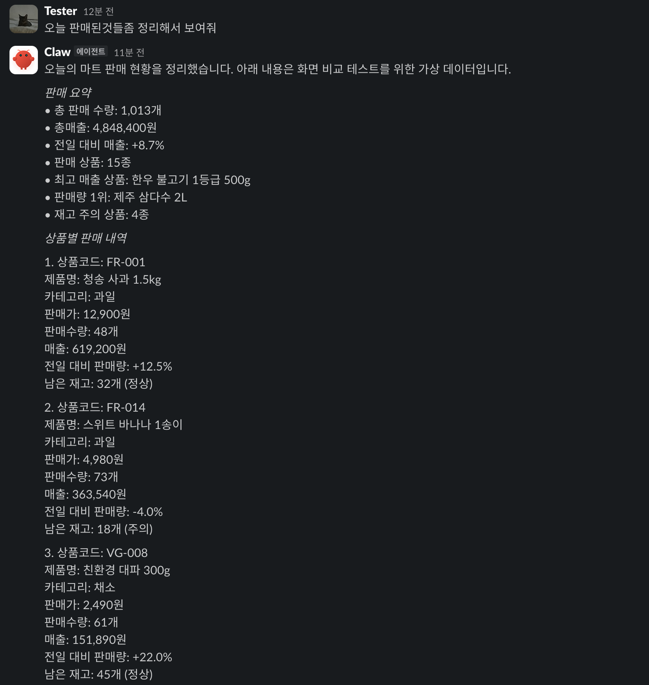
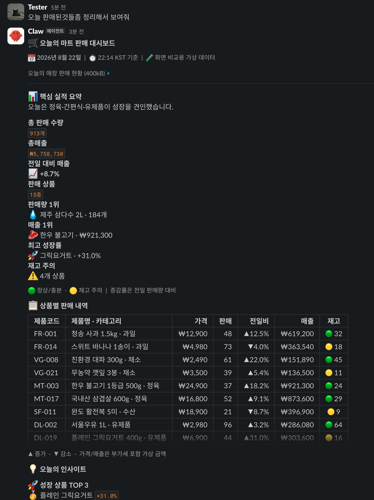

# OpenClaw Slack Block Kit

[English](README.md) | **한국어**

OpenClaw 에이전트가 표, 이미지 카드, 정밀한 필드 배치 같은 Slack 전용 Block Kit
메시지를 **현재 Slack 채널·DM·스레드**에 보내게 해주는 플러그인입니다.

- OpenClaw에 이미 설정된 Slack 연결을 재사용합니다.
- 현재 대화와 스레드를 자동으로 상속합니다.
- 모델에 Slack token이나 channel ID를 요구하지 않습니다.
- `slack_send_blocks`라는 Slack 전용 도구 하나만 노출합니다.

## Before / After

같은 유형의 가상 판매 리포트를 일반 텍스트와 Block Kit으로 표현한 비교입니다.

| 일반 텍스트 답변 | `slack_send_blocks` 사용 |
|:---:|:---:|
|  |  |

## 어떤 경로를 써야 하나요?

| 필요한 결과 | 권장 경로 |
|---|---|
| 일반 텍스트 또는 여러 채널에서 통하는 범용 카드 | OpenClaw 기본 `message` + `presentation` |
| Slack 전용 레이아웃 제어, image accessory, 정밀한 `section.fields`, `rich_text`, 또는 `presentation`으로 표현할 수 없는 block 조합 | 이 플러그인의 `slack_send_blocks` |
| callback이 있는 버튼/select, modal, App Home, 파일·비디오 workflow | 별도 interactive Slack integration |

기본 `presentation`으로 충분하면 그 경로를 사용하세요. 이 플러그인은 Slack 전용 raw
Block Kit이 실제로 필요할 때만 쓰는 display-only escape hatch이며, 모든 에이전트 답변을
카드로 바꾸지 않습니다.

## 설치

요구사항:

- OpenClaw `2026.7.1-2` 이상
- OpenClaw에서 이미 동작하는 Slack 연결

### ClawHub (권장)

```bash
openclaw plugins install clawhub:openclaw-slack-block-kit
```

ClawHub가 이 플러그인의 기본 검색·설치 경로입니다.

### npm (직접 설치 대안)

```bash
openclaw plugins install npm:openclaw-slack-block-kit
```

### 도구 노출과 정책

이 단일 목적 플러그인을 설치하고 활성화하는 것 자체가 opt-in이며, 도구는 Slack
turn에서만 생성됩니다. `plugins.allow`가 없거나 `slack-block-kit`을 포함하고,
적용되는 tool profile이 없거나 `full`이며, 제한적인 allow/deny 정책이 없고, agent가
sandbox를 사용하지 않거나 sandbox tool policy가 이미 `slack_send_blocks`를 허용한다면
설치 외에 `openclaw.json`을 따로 수정할 필요가 없습니다.

새 로컬 OpenClaw 설정에는 제3자 플러그인 도구를 포함하지 않는
`tools.profile: "coding"`이 자주 사용됩니다. `coding`, `messaging`, `minimal`을
사용한다면 영향을 받는 전역 또는 agent `tools` scope에 다음을 병합하세요.

```json5
{
  tools: {
    alsoAllow: ["slack_send_blocks"],
  },
}
```

같은 scope에 이미 `tools.allow`가 있다면 `alsoAllow`를 추가하지 말고 기존 `allow`
배열에 `slack_send_blocks`를 추가하세요. OpenClaw는 한 scope의 `allow`와
`alsoAllow`를 함께 허용하지 않습니다. agent 수준의 `tools.alsoAllow`는 전역 추가 목록을
대체하므로 해당 agent에 이 설정이 있다면 그 목록에도 `slack_send_blocks`를
추가하세요. provider 또는 model별 정책이 필터링한다면 일치하는
`tools.byProvider["<provider>"]` 또는 `tools.byProvider["<provider>/<model>"]` scope(또는 해당
agent scope)에서도 도구를 허용하세요.

sandbox를 사용하는 agent는 `tools.sandbox.tools.alsoAllow`(또는 기존 `allow` 배열)에서도
같은 도구를 반드시 허용해야 합니다. 명시적인 sandbox tool policy가 없어도 OpenClaw의
기본 sandbox allowlist에는 플러그인 도구가 포함되지 않습니다. 특정 agent에서 숨기려면
해당 agent의 `tools.deny`에 `slack_send_blocks`를 추가하세요.

### 확인

```bash
openclaw plugins inspect slack-block-kit --runtime --json
openclaw gateway status
```

runtime 출력에 `slack_send_blocks`와 플러그인 hooks가 보여야 합니다. 플러그인 설치 시
managed Gateway가 보통 자동으로 재시작됩니다. 새 runtime이 로드되지 않았다면
`openclaw gateway restart`를 한 번 실행하세요. inspect 결과가 disabled라면
`openclaw plugins enable slack-block-kit`을 실행하세요.

## Slack에서 사용하기

결과를 받을 Slack 대화에서 자연어로 요청하면 됩니다.

```text
오늘 판매 현황을 핵심 요약과 비교표가 있는 Slack 대시보드로 정리해서 이 스레드에 보여줘.
```

도구 description이 Slack 전용 레이아웃이 필요한 시점을 에이전트에게 알려줍니다. 정확한
경로를 강제하고 싶다면 도구명을 명시하세요.

```text
slack_send_blocks를 사용해서 아래 후보들을 이미지 카드로 현재 스레드에 보여줘.
```

전송에 성공하면 Block Kit 메시지 자체가 최종 답변입니다. 별도 일반 텍스트 답변은 의도적으로
붙지 않습니다. 각 메시지에는 Slack 알림과 접근성을 위한 fallback `text`가 포함됩니다.

도구 입력으로 목적지를 바꿀 수는 없습니다. 다른 채널·계정·스레드로 명시적으로 보내려면
OpenClaw 기본 `message` 도구를 사용하세요.

## 지원 범위

- 호출당 메시지 1~10개를 입력 순서대로 전송
- 메시지당 block 1~50개
- 메시지당 1~4,000자의 필수 fallback `text`
- `section`, `fields`, image accessory, `context`, `header`, `divider`, `image`
- `rich_text`, `table`, 새로운 message-surface block passthrough
- 현재 Slack 채널·DM·스레드 자동 상속
- OpenClaw의 기존 Slack 인증, durable outbound queue, hooks, receipt 재사용

v1에서 지원하지 않는 범위:

- `action_id`가 필요한 interactive element
- `actions`와 `input` block
- modal과 App Home
- external select option loading
- `file`, `video`, `call` block lifecycle
- 여러 메시지의 원자적 전송

알 수 없는 message block은 재작성하지 않고 전달합니다. 현재 워크스페이스와 message surface에서
block 조합을 실제로 수락할지는 Slack API가 최종 판단합니다.

## 고급: 정확한 도구 입력

공개 입력 envelope는 다음과 같습니다.

```json
{
  "messages": [
    {
      "text": "접근성·알림용 fallback",
      "blocks": [
        {
          "type": "section",
          "text": { "type": "mrkdwn", "text": "*후보 1*" },
          "accessory": {
            "type": "image",
            "image_url": "https://example.com/item.png",
            "alt_text": "후보 이미지"
          }
        }
      ]
    }
  ],
  "validateOnly": false
}
```

`text`와 `blocks`는 각 `messages[]` 항목 안에 있어야 합니다. 최상위의 flat `text` 또는
`blocks`, 누락 필드, 추가 필드, 잘못된 타입은 `INVALID_ARGUMENT`으로 거절됩니다.

`validateOnly: true`는 Slack에 보내지 않고 로컬 구조·크기·보안 검증만 수행합니다. Slack이
모든 최신 block 조합을 수락한다고 보장하지는 않습니다.

여러 메시지 전송은 원자적이지 않습니다. `partial_failed` 뒤에는 실패한 index만 다시
구성해 보내세요. 전체 batch를 재시도하면 이미 성공한 메시지가 중복될 수 있습니다.

## 문제 해결

### 도구가 보이지 않음

1. Slack에서 요청을 시작하세요. 다른 surface에서는 도구가 숨겨집니다.
2. `openclaw plugins inspect slack-block-kit --runtime --json`을 실행하세요.
3. `plugins.allow`를 사용한다면 `slack-block-kit`을 포함하세요.
4. `tools.profile`이 `coding`, `messaging`, `minimal`이거나 agent가 제한적인
   `tools.allow`를 사용한다면 `tools.alsoAllow`로 `slack_send_blocks`를 허용하세요.
   같은 scope에 이미 `allow`가 있다면 기존 배열에 추가하세요.
5. agent 또는 일치하는 `tools.byProvider` scope가 자체 정책을 사용한다면 그곳에서도
   도구를 허용하세요. agent 수준의 `alsoAllow`는 전역 추가 목록을 대체합니다.
6. agent가 sandbox를 사용한다면 `tools.sandbox.tools.alsoAllow`(또는 기존 `allow`
   배열)에서도 `slack_send_blocks`를 허용하세요. 명시적인 sandbox tool policy가
   없어도 필요합니다.

### `INVALID_BLOCK_KIT`

`error.issues[].path`를 따라 block 수, URL, 중첩 깊이, 중복 ID 또는 지원하지 않는 interactive
element를 수정하세요.

### `INVALID_ROUTE`

현재 Slack delivery context를 받지 못했습니다. Telegram, CLI 등이 아니라 실제 Slack
채널·DM·스레드에서 요청을 시작했는지 확인하세요.

### Slack의 `invalid_blocks`

로컬 안전 검증은 통과했지만 Slack이 현재 block 조합을 거절했습니다. Slack의 최신 block
reference에서 확인하거나 Block Kit Builder에서 먼저 조합해 보세요.

## 보안

- 별도 Slack token을 입력하거나 저장하지 않습니다.
- trusted current Slack route에서만 목적지를 가져옵니다.
- URL-bearing field에는 유효한 `https:` URL만 허용합니다.
- model-facing 오류에 token, 전체 payload, 내부 stack을 넣지 않습니다.
- fallback text, blocks, 이미지 URL에 secret이나 민감한 signed URL을 넣지 마세요.

## 소스에서 개발하기

Node.js와 `pnpm`은 소스 개발 시에만 필요합니다.

```bash
git clone https://github.com/demarlik01/openclaw-slack-block-kit.git
cd openclaw-slack-block-kit
pnpm install --frozen-lockfile
pnpm build
openclaw plugins install --link "$PWD"
openclaw plugins enable slack-block-kit
```

릴리스 검증 명령:

```bash
pnpm typecheck
pnpm test
pnpm verify:completion
pnpm plugin:metadata-check
pnpm plugin:validate
npm pack --dry-run
```

completion probe는 새 프로세스에서 실행되며 실제 Slack 메시지를 보내지 않습니다. 정확한 route,
validation, durability, error, fail-open completion 계약은 아키텍처 문서를 참고하세요.

## 참고 문서

- 아키텍처: [한국어](docs/ARCHITECTURE.md) · [English](docs/ARCHITECTURE.en.md)
- Slack: [Block Kit 개요](https://docs.slack.dev/block-kit/) · [전체 block](https://docs.slack.dev/reference/block-kit/blocks/) · [Section과 fields](https://docs.slack.dev/reference/block-kit/blocks/section-block/) · [Table](https://docs.slack.dev/reference/block-kit/blocks/table-block/) · [Block Kit Builder](https://app.slack.com/block-kit-builder)
- OpenClaw: [플러그인 설치](https://docs.openclaw.ai/cli/plugins) · [Tool profile과 policy](https://docs.openclaw.ai/gateway/config-tools) · [플러그인 개발](https://docs.openclaw.ai/plugins/building-plugins)

## 라이선스

[MIT](LICENSE)
