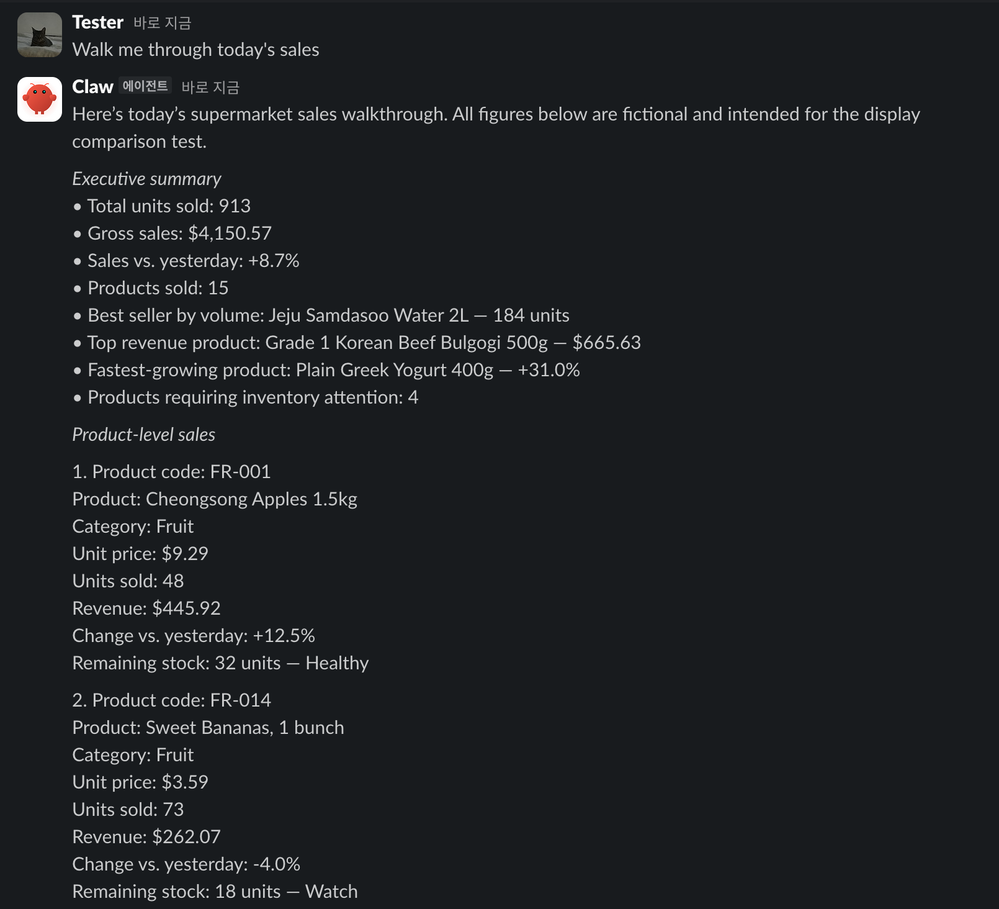
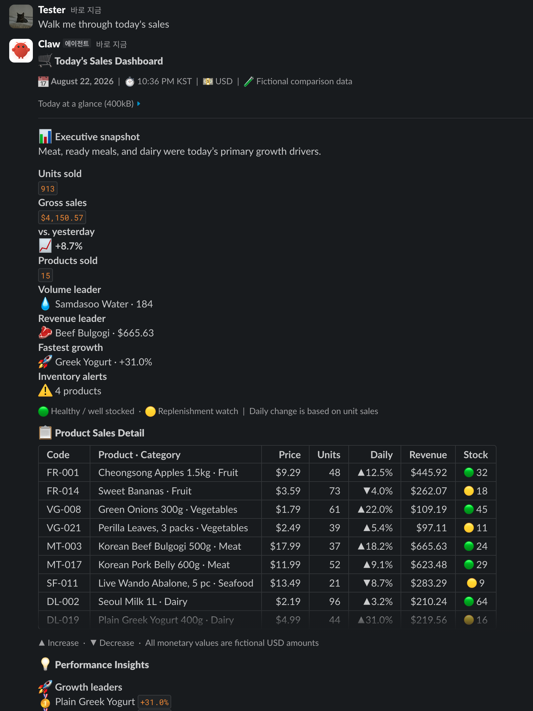

# OpenClaw Slack Block Kit

**English** | [한국어](README.ko.md)

Send tables, image cards, precise field layouts, and other Slack-native Block Kit
messages from an OpenClaw agent to the **current Slack channel, DM, or thread**.

- Reuses the Slack connection already configured in OpenClaw.
- Inherits the current conversation and thread automatically.
- Never asks the model for a Slack token or channel ID.
- Exposes one optional, Slack-only tool: `slack_send_blocks`.

## Before / After

The same fictional sales report rendered as a normal reply and as Block Kit.

| Plain text reply | With `slack_send_blocks` |
|:---:|:---:|
|  |  |

## Choose the right path

| Need | Use |
|---|---|
| Plain text or a portable card that works across channels | OpenClaw core `message` + `presentation` |
| Slack-native layout control, image accessories, precise `section.fields`, `rich_text`, or block combinations that `presentation` cannot express | This plugin's `slack_send_blocks` |
| Buttons/selects with callbacks, modals, App Home, or file/video workflows | A dedicated interactive Slack integration |

Use core `presentation` whenever it is sufficient. This plugin is a display-only escape
hatch for messages that genuinely need raw Slack Block Kit; it does not convert every
agent reply into a card.

## Install

Requirements:

- OpenClaw `2026.7.1-2` or later
- A Slack connection that already works in OpenClaw

### ClawHub (recommended)

```bash
openclaw plugins install clawhub:openclaw-slack-block-kit
```

ClawHub is the primary discovery and install path for this plugin.

### npm (direct-install fallback)

```bash
openclaw plugins install npm:openclaw-slack-block-kit
```

### Allow the optional tool

Add only `slack_send_blocks` to the agent that should use it:

```json5
{
  agents: {
    list: [
      {
        id: "my-agent",
        tools: { alsoAllow: ["slack_send_blocks"] },
      },
    ],
  },
}
```

If that scope already has `tools.allow`, add `slack_send_blocks` to the existing
`allow` array instead; `allow` and `alsoAllow` cannot be used together in the same
scope. Allowing the single tool is safer than allowing every plugin tool.

### Verify

```bash
openclaw plugins inspect slack-block-kit --runtime --json
openclaw gateway status
```

The runtime output should show `slack_send_blocks` and the plugin hooks. Plugin installs
normally trigger a managed Gateway restart; if the new runtime is not loaded, run
`openclaw gateway restart` once. If inspection reports the plugin as disabled, run
`openclaw plugins enable slack-block-kit`.

## Use it from Slack

Ask naturally from the Slack conversation where the result should appear:

```text
Show today's sales as a Slack dashboard with a concise summary and comparison table in this thread.
```

The tool description tells the agent when a Slack-native layout is appropriate. If you
want to force the exact path, mention it explicitly:

```text
Use slack_send_blocks to show these candidates as image cards in the current thread.
```

On a successful send, the Block Kit message is the final answer. A second plain-text
reply is intentionally not added. Every message still includes fallback `text` for
Slack notifications and accessibility.

The destination cannot be overridden through tool input. To send explicitly to a
different channel, account, or thread, use OpenClaw's core `message` tool instead.

## What it supports

- 1–10 messages per call, delivered in input order
- 1–50 blocks per message
- Required fallback `text` of 1–4,000 characters per message
- `section`, `fields`, image accessories, `context`, `header`, `divider`, and `image`
- Passthrough for `rich_text`, `table`, and new message-surface blocks
- Current Slack channel/DM/thread inheritance
- OpenClaw's existing Slack auth, durable outbound queue, hooks, and receipts

Not supported in v1:

- Interactive elements that require an `action_id`
- `actions` and `input` blocks
- Modals and App Home
- External-select option loading
- `file`, `video`, and `call` block lifecycles
- Atomic multi-message delivery

Unknown message blocks are forwarded without being rewritten. Slack's API remains the
final authority on whether a block combination is valid for the current workspace and
message surface.

## Advanced: exact tool input

The public input envelope is:

```json
{
  "messages": [
    {
      "text": "Fallback for accessibility and notifications",
      "blocks": [
        {
          "type": "section",
          "text": { "type": "mrkdwn", "text": "*Candidate 1*" },
          "accessory": {
            "type": "image",
            "image_url": "https://example.com/item.png",
            "alt_text": "Candidate image"
          }
        }
      ]
    }
  ],
  "validateOnly": false
}
```

`text` and `blocks` belong inside every `messages[]` item. Flat top-level `text` or
`blocks`, missing fields, extra fields, and wrong types are rejected with
`INVALID_ARGUMENT`.

`validateOnly: true` runs local structure, size, and safety checks without sending to
Slack. It does not guarantee that Slack will accept every new block combination.

Multi-message calls are not atomic. After a `partial_failed` result, retry only the
failed indexes; retrying the entire batch can duplicate messages that already succeeded.

## Troubleshooting

### The tool does not appear

1. Start the request from Slack; the tool is hidden on other surfaces.
2. Run `openclaw plugins inspect slack-block-kit --runtime --json`.
3. If `plugins.allow` is configured, include `slack-block-kit`.
4. Include `slack_send_blocks` in the agent's `tools.allow` or `tools.alsoAllow`.
5. For sandboxed agents, allow the tool in the sandbox policy too.

### `INVALID_BLOCK_KIT`

Follow `error.issues[].path` and correct the reported block count, URL, nesting depth,
duplicate ID, or unsupported interactive element.

### `INVALID_ROUTE`

The tool did not receive the current Slack delivery context. Start the request from an
actual Slack channel, DM, or thread rather than Telegram, CLI, or another surface.

### Slack returns `invalid_blocks`

The payload passed local safety checks, but Slack rejected the current block combination.
Check it against Slack's current block reference or prototype it in Block Kit Builder.

## Security

- No separate Slack token is accepted or stored.
- The destination is taken only from the trusted current Slack route.
- URL-bearing fields must contain valid `https:` URLs.
- Model-facing errors omit tokens, full payloads, and internal stacks.
- Do not place secrets or sensitive signed URLs in fallback text, blocks, or image URLs.

## Develop from source

Node.js and `pnpm` are required only for source development.

```bash
git clone https://github.com/demarlik01/openclaw-slack-block-kit.git
cd openclaw-slack-block-kit
pnpm install --frozen-lockfile
pnpm build
openclaw plugins install --link "$PWD"
openclaw plugins enable slack-block-kit
```

Run the release checks with:

```bash
pnpm typecheck
pnpm test
pnpm verify:completion
pnpm plugin:metadata-check
pnpm plugin:validate
npm pack --dry-run
```

The completion probe runs in a fresh process and sends nothing to Slack. See the
architecture docs for the exact route, validation, durability, error, and fail-open
completion contracts.

## References

- Architecture: [English](docs/ARCHITECTURE.en.md) · [한국어](docs/ARCHITECTURE.md)
- Slack: [Block Kit overview](https://docs.slack.dev/block-kit/) · [All blocks](https://docs.slack.dev/reference/block-kit/blocks/) · [Section and fields](https://docs.slack.dev/reference/block-kit/blocks/section-block/) · [Table](https://docs.slack.dev/reference/block-kit/blocks/table-block/) · [Block Kit Builder](https://app.slack.com/block-kit-builder)
- OpenClaw: [Plugin installation](https://docs.openclaw.ai/cli/plugins) · [Building plugins](https://docs.openclaw.ai/plugins/building-plugins)

## License

[MIT](LICENSE)
