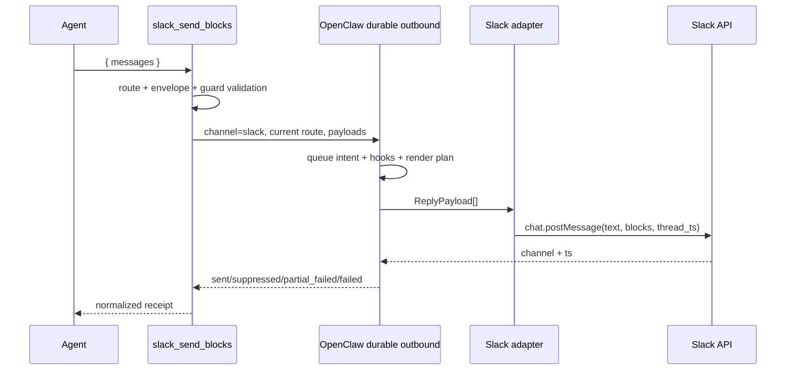

# OpenClaw Slack Block Kit Architecture

[한국어](./ARCHITECTURE.md) · English

> Status: documentation for the v1 implementation
> Baseline runtime: OpenClaw `2026.7.1-2`
> Scope: message-surface raw Block Kit sent to the current Slack conversation

The Korean document, [`ARCHITECTURE.md`](./ARCHITECTURE.md), is the canonical normative
architecture specification. This English document is a maintained normative translation. If the
two documents diverge, the Korean document takes precedence.

## 1. Conclusion

Use OpenClaw's shared `presentation` path by default. This plugin is an escape hatch to use only
when Slack-specific message UI that cannot be expressed through `presentation` is genuinely
required.

```text
Expressible as a shared card
  → core message + presentation

Requires a Slack message-surface-specific representation
  → slack_send_blocks + raw channelData.slack.blocks

Requires a modal / App Home / external select / file or video workflow
  → out of scope for this plugin; use a separate Slack application surface
```

The problem this plugin solves is not “reimplementing the Slack API.” Its purpose is to expose raw
Block Kit payloads through a safe and predictable tool contract while reusing OpenClaw's existing
current-channel, account, and thread context and durable outbound path.

## 2. Goals and Non-goals

### Goals

- Provide the Slack-only agent tool `slack_send_blocks`
- Automatically inherit the currently executing Slack conversation and thread
- Send multiple messages sequentially in one call
- Pass mandatory fallback `text` and raw `blocks` for every message
- Reuse OpenClaw's existing Slack authentication, target resolution, hooks, queue, receipts, and
  unknown-send recovery
- Perform minimum structural, resource, and security validation before sending
- Return distinct validated, sent, suppressed, partial_suppressed, incomplete_sent, partial_failed,
  and failed results
- Instruct the agent to finish with exactly `NO_REPLY` after every message is successfully sent
- Preserve OpenClaw progress and final-response handling without registering global send hooks

### Non-goals

- Automatically convert every OpenClaw response into Block Kit
- Replace the shared `presentation` mechanism
- Own a separate Slack token, Socket Mode connection, or HTTP ingress
- Act as a general-purpose Slack client that can send to arbitrary channels, accounts, or threads
- Replicate the full Slack Block Kit JSON Schema within this project
- Handle button/select actions in v1
- Support modals, App Home, Options Load, workflow steps, file registration/sharing, or video unfurls
- Guarantee atomic delivery for the entire batch

## 3. Supported Scope

| Capability | v1 | Notes |
|---|---:|---|
| Current Slack channel/DM | Supported | Uses `deliveryContext.to` |
| Current Slack thread | Supported | Inherits `deliveryContext.threadId` |
| Sequential multi-message send | Supported | Preserves payload order |
| section, header, context, divider, image, rich_text, table, data_visualization | Known display passthrough | Common guards apply without an unknown-type warning; only section accessories are limited to images |
| Unknown new message block | Warning-bearing passthrough | Not blocked, to avoid version drift |
| button/static select interaction | Rejected | Add through a namespaced handler in v2 |
| actions/input block | Rejected | Interaction-only or view-only |
| file/video/call block | Rejected | Requires separate permissions and registration/unfurl lifecycle |
| modal / App Home | Unsupported | Separate `views.*`-based surface |
| external select | Unsupported | Requires a separate Options Load endpoint |
| File/video workflow | Unsupported | Requires separate permissions and API lifecycle |

The validator treats `section`, `header`, `context`, `divider`, `image`, `rich_text`, `table`, and
`data_visualization` as one set of known display block names. Membership changes only whether an
unknown-type warning is emitted. The eight known types and warning-bearing unknown types receive the
same common structure, size, URL, and interaction guards, while their detailed schemas remain
passthrough. The only type-specific local rule is that a section accessory must be an image. Every
allowed block is forwarded as a raw payload, and the Slack API is the final schema validator.

## 4. Core Components and Responsibilities

| Component | Responsibilities | Does not |
|---|---|---|
| Producer | Fetch data, sort, paginate, and create fallback text and complete blocks | Guess channel/account/thread or call the Slack API |
| `slack_send_blocks` | Verify the current route, perform minimum validation, send through the durable outbound path, and normalize the result | Rewrite blocks or decide business policy |
| OpenClaw outbound runtime | Authentication, hooks, queue, Slack adapter invocation, receipts, and recovery | Design Slack-specific UI |
| Slack API | Final validation against the latest Block Kit schema and workspace permissions | Automatically fix producer bugs |

The plugin does not arbitrarily reorder or truncate blocks created by the producer. It explicitly
rejects payloads that exceed limits or are unsafe.

## 5. Public Tool Contract

### `slack_send_blocks`

```typescript
type SlackSendBlocksInput = {
  messages: Array<{
    text: string;
    blocks: Array<Record<string, unknown>>;
  }>;
  validateOnly?: boolean;
};
```

Routing fields are not accepted in the input.

- No `target`
- No `accountId`
- No `threadTs`
- No Slack token

Preventing destination overrides through tool input reduces the risk that the model guesses a
channel ID and sends to the wrong destination. Use the core `message` tool when a message must be
sent explicitly to another destination.

### Input Limits

- 1–10 messages per call
- Fallback `text` of 1–4,000 characters per message
- 1–50 blocks per message
- Maximum 200 KiB of serialized blocks per message
- Maximum 1 MiB of serialized blocks for the entire call
- Maximum nesting depth of 20

The 200 KiB and 1 MiB values do not reproduce official Slack limits. They are defensive limits in
this plugin that protect the runtime from model-generated payloads.

### Successful Result

```json
{
  "ok": true,
  "status": "sent",
  "complete": true,
  "sent": [
    {
      "index": 0,
      "messageId": "1755771000.123456",
      "channelId": "C12345678"
    }
  ],
  "nextAction": {
    "type": "silent_final",
    "token": "NO_REPLY",
    "instruction": "The Block Kit message is already visible. Return exactly NO_REPLY with no other text."
  },
  "suppressed": [],
  "failed": [],
  "warnings": []
}
```

### Partial-failure Result

```json
{
  "ok": false,
  "status": "partial_failed",
  "sent": [
    {
      "index": 0,
      "messageId": "1755771000.123456",
      "channelId": "C12345678"
    }
  ],
  "suppressed": [],
  "failed": [
    {
      "index": 1,
      "stage": "platform_send",
      "sentBeforeError": true,
      "error": {
        "code": "SLACK_API_ERROR",
        "message": "invalid_blocks"
      }
    }
  ],
  "error": {
    "code": "SLACK_API_ERROR",
    "message": "invalid_blocks"
  },
  "warnings": []
}
```

Batches are not atomic. If a caller retries an entire batch after receiving `partial_failed`,
messages that were already sent may be duplicated. The caller must reconstruct and retry only the
failed indexes.

## 6. Plugin Registration

This project registers one default-visible Slack-only tool. It uses `defineToolPlugin` for the tool
declaration and generated manifest metadata. It registers no send hooks, tool-completion observers,
or lifecycle handlers for completion-state cleanup.

```text
plugin.register (defineToolPlugin)
  └─ static tool: slack_send_blocks (default-visible)
       └─ factory(toolContext)
            ├─ returns null unless the surface is Slack
            └─ on Slack, returns a tool that captures the current deliveryContext
```

`openclaw plugins build` generates the following manifest metadata.

- `activation`
- `contracts.tools: ["slack_send_blocks"]`
- `configSchema`

Permission-level `optional` metadata and `toolMetadata` are intentionally omitted. Installing and
enabling this single-purpose plugin is the normal opt-in, while the factory still returns `null`
outside Slack turns. The factory resolves the surface as
`deliveryContext.channel ?? messageChannel`; actual delivery must still pass the stricter
current-route check below.

This decision means required/default-visible only at the plugin-registration layer. It does not
bypass OpenClaw host policy. Effective global, agent, and provider `tools.profile` and allow/deny
rules, plus sandbox tool policy, still take precedence.

- Normal tool policy: the value to add to a restricted profile or allowlist is the exact tool name
  `slack_send_blocks`. A scope cannot contain both `allow` and `alsoAllow`; add it to an existing
  `allow`, or use `alsoAllow` on top of a profile.
- Local onboarding: when a new local config has no value, onboarding sets
  `tools.profile: "coding"` and preserves an existing explicit profile. `coding`, `messaging`, and
  `minimal` do not include this third-party native plugin tool by default. `full` and an unset
  profile do not themselves restrict tools.
- Additional sandbox gate: a sandboxed turn needs a second grant after normal policy. Use the native
  plugin id `slack-block-kit` to grant only this plugin, or `group:plugins` only when every plugin
  tool should be granted, in `tools.sandbox.tools.alsoAllow` or the existing sandbox `allow`.
  The default sandbox allowlist contains no plugin tools even when no sandbox policy is configured.

Whenever the tool name or schema changes, rerun both the generator and
`openclaw plugins validate`. If runtime registration disagrees with `contracts.tools` ownership,
that tool registration is skipped and a diagnostic is emitted. `plugin:metadata-check` and
`plugin:validate` must treat this drift as a release failure.

## 7. Current-route Resolution

Trust only the `OpenClawPluginToolContext.deliveryContext` received by the tool factory as the
delivery destination. Here, “current route” means the exact Slack channel or DM that invoked the
tool, and the thread in which the invocation began. `messageChannel` is only a fallback for deciding
whether to create the factory tool; it is not a substitute delivery route.

The actual delivery route is:

```text
channel  = deliveryContext.channel  // must be "slack"
to       = deliveryContext.to       // required
account  = deliveryContext.accountId ?? agentAccountId
thread   = deliveryContext.threadId
```

`validateOnly: true` is the exception. After input and block validation, it returns `validated`
before the route and runtime-config gates and does not call the durable sender. For an actual send,
either do not expose the tool or return a structured error in the following cases.

- The current surface is not Slack
- `deliveryContext.to` is missing
- The current runtime config cannot be obtained

v1 provides no path for input arguments to override the ambient route.

## 8. Delivery Path

Use the public durable helper `sendDurableMessageBatch(...)` instead of calling
`loadAdapter("slack").sendPayload(...)` directly.



Each payload has the following form.

```typescript
{
  text: message.text,
  channelData: {
    slack: {
      blocks: message.blocks
    }
  }
}
```

This path reuses the following facilities.

- Existing `channels.slack` authentication and SecretRef
- Account and DM/channel target handling
- `message_sending`-family hooks
- Write-ahead delivery queue
- Platform receipts
- Ambiguous/unknown-send recovery
- Per-payload outcomes and partial failures

## 9. Validation Philosophy

### What Is Validated

1. TypeBox envelope
   - Basic types and counts for `messages`, `text`, `blocks`, and `validateOnly`
   - The same TypeBox schema is checked again at the tool execution entry point rather than
     assuming that the host/bridge enforces schema validation. Flat `text`/`blocks`, missing
     `messages`, and additional properties are rejected with a structured `INVALID_ARGUMENT`, and
     the durable sender is not invoked.
2. Runtime resource guards
   - Block count, serialized size, and nesting depth
3. Shared identifier guards
   - Type, length, and per-message uniqueness of `block_id`
   - Type, length, and uniqueness checks for `action_id` only improve diagnostics; the presence of
     any `action_id` is always rejected in display-only v1 regardless of its validity
4. v1 scope guards
   - Reject `input` blocks
   - Reject `actions`, `file`, `video`, and `call` blocks
   - Reject every element/object containing `action_id`
5. JSON safety
   - Reject circular references or values that cannot be serialized
6. URL guards
   - `url`, `image_url`, and `thumb_url` must be non-empty strings
   - String values must be valid `https:` URLs

### What Is Not Validated

- A replica allowlist of every Slack block/element type
- Every per-block text length and field combination
- New Slack types rejected merely because they are unknown
- Automatic correction of invalid payloads

Slack Block Kit continues to evolve. Maintaining a project-local strict schema would prevent new
types from being used and create two conflicting sources of truth that can disagree with Slack's
actual validator. The local validator therefore guarantees only safety and the explicit v1 scope,
while the Slack API performs the latest semantic validation.

## 10. Interaction Policy

v1 is display-only. Elements containing `action_id` are rejected.

This is a product policy, not a rendering limitation: it prevents dead UI that appears clickable
but does nothing when a user clicks it. If buttons or selects are needed and the shared
`presentation` mechanism is sufficient, use the core path.

Adding raw interactions in v2 requires all of the following.

- Enforce an `action_id` namespace, for example `sbk:<handler>:<action>`
- Use OpenClaw `registerInteractiveHandler`
- Respond first within Slack's short ACK deadline
- Business-level idempotency for duplicate delivery and retries
- Validate permissions, user, and current message
- Define message-update and ephemeral-error policies
- Start with static selects and keep external selects in a separate scope

## 11. Final-response Contract

The raw Block Kit send is itself the user-visible final result. Preventing a duplicate ordinary
response relies on the agent following the `NO_REPLY` instruction.

- The tool description instructs the agent to call this tool alone as the last tool call of the turn.
- Only `ok: true`, `status: sent`, `complete: true` results request exactly `NO_REPLY` through
  `nextAction`. The model finishes normally with that silent final and no additional text.
- Validation-only, failed, partial, suppressed, and incomplete outcomes contain no silent-final
  instruction. The agent can explain the outcome or perform recovery.
- Every result has `terminate: false`, allowing the model to finish normally instead of forcing the
  run to end inside the tool.

The plugin stores no completion markers after delivery and never cancels final responses. If the
agent ignores `NO_REPLY`, an additional plain-text response can appear; duplicate prevention is not
guaranteed by code. OpenClaw manages progress, commentary, errors, and final-response delivery.

OpenClaw `2026.9.4` Slack handling disables `progress` streaming when any global
`reply_payload_sending` or `message_sending` hook exists. Restricting a hook's callback to finals
does not avoid this registration-level effect, so this plugin registers neither hook. Other
plugins' send hooks and host settings can still affect progress visibility.

An earlier OpenClaw `2026.7.1-2` live smoke test found that a custom tool's `terminate: true` was not
counted as normal response completion, resulting in `incomplete_turn / abandoned` and a fallback
error. Removing the hooks therefore preserves `terminate: false` and the successful-send
`NO_REPLY` contract.

## 12. Error and Durability Model

The tool distinguishes the following states.

| Status | Meaning | Model follow-up |
|---|---|---|
| `validated` | Validation completed; no external send | normal response |
| `sent` | Platform receipts confirmed for every payload (`complete: true`) | `NO_REPLY` |
| `partial_suppressed` | Some payloads sent and others suppressed by hook cancellation, empty payloads, or a missing identifiable receipt | explain and recover |
| `incomplete_sent` | Top-level send succeeded, but completion of every payload could not be proven | explain and recover |
| `suppressed` | Durable delivery produced no identifiable visible-delivery result (for example hook cancellation, an empty payload, or `adapter_returned_no_identity`) | explain and recover |
| `partial_failed` | A later payload failed after some payloads were sent | explain and recover |
| `failed` | Failed without a platform receipt | explain and recover |

In every state, the tool result contains JSON text in `content`, the same object in `details`, and
`terminate: false`. The principal result shapes are:

- `validated`: `messageCount`, `blockCounts`, and `warnings`
- complete `sent`: `complete: true`, index-addressed `sent[]`, `warnings`, and `nextAction`
- `partial_suppressed` / `incomplete_sent`: `complete: false`, observed `sent[]`, `suppressed[]`, and
  `failed[]`; no `nextAction`
- `suppressed`: a top-level `reason` and index-addressed `suppressed[]`
- `partial_failed`: successful `sent[]`, index-addressed `failed[]`, and a normalized top-level
  `error`
- `failed`: always a normalized top-level `error`; a durable outcome may additionally provide
  `stage` and index-addressed `failed[]`

Local contract error codes are `INVALID_ARGUMENT`, `INVALID_BLOCK_KIT`, `INVALID_ROUTE`, and
`RUNTIME_CONFIG_UNAVAILABLE`. Errors at the durable/Slack boundary normalize to
`SLACK_RATE_LIMITED` or `SLACK_API_ERROR`. Serialized results include `retryAfter` only when a valid
value is present in rate-limit metadata.

Slack API error strings are limited to 500 characters. Common token patterns of the forms `xox...`,
`Bearer ...`, and `token|secret|password=...` are redacted on a best-effort basis; this is not an
arbitrary-secret detector. Complete payloads, internal stacks, and durable hook diagnostics are
structurally excluded from model-facing results.

The native durable queue handles crashes before and after a platform send and unknown-send
recovery. It does not semantically deduplicate the same business request repeated as a new tool
call. Persistent `requestId`-based business idempotency will be designed with a separate store if a
real producer requirement emerges.

## 13. Security

- Do not accept a separate Slack token as input, configuration, or log data.
- Do not route outside the current `deliveryContext`.
- Always require fallback `text` for accessibility and notifications.
- Do not log complete raw blocks or complete Slack errors.
- Return at most 50 entries in `error.issues`; passthrough `warnings` are not subject to this cap.
- Create the tool only for Slack turns; effective global, agent, and provider tool profiles and
  policies, plus sandbox tool policy, still take precedence over plugin-level default exposure.
- In normal tool policy, narrowly grant the exact tool name `slack_send_blocks`.
- Require a sandbox-layer grant by plugin id `slack-block-kit` or `group:plugins` for sandboxed
  agents; the default sandbox allowlist excludes plugin tools even without an explicit policy.
- For URL-bearing fields, the plugin verifies a non-empty string and enforces `https:`. The producer
  is responsible for allowed-domain and image-source policy, and sensitive signed URLs are not
  echoed back in the tool result.

## 14. Project Structure

```text
openclaw-slack-block-kit/
├── docs/
│   ├── ARCHITECTURE.md       # canonical normative design
│   ├── ARCHITECTURE.en.md    # maintained normative English translation
│   └── images/               # README Before/After screenshots
├── scripts/
│   └── normalize-package-modes.mjs    # normalize npm tarball file modes
├── src/
│   ├── index.ts              # defineToolPlugin entry
│   ├── tool.ts               # current-route durable tool
│   ├── tool-copy.ts          # model-facing tool copy and Slack reference URL
│   ├── schema.ts             # TypeBox envelope
│   ├── validator.ts          # minimum guard validation
│   ├── errors.ts             # safe error normalization
│   └── types.ts              # input and validation types
├── test/
│   ├── metadata.test.ts      # plugin metadata/manifest contract
│   ├── schema-copy.test.ts   # prevent schema-description drift
│   ├── tool-copy.test.ts     # pin required model-facing selection/completion copy
│   ├── tool.test.ts          # route, durable outcome, silent-final result
│   └── validator.test.ts     # resource/scope guards
├── LICENSE
├── openclaw.plugin.json        # generated manifest contract
├── package.json                # build/test/validation/publish scripts
├── pnpm-lock.yaml
├── README.ko.md
├── README.md
├── tsconfig.build.json
└── tsconfig.json
```

## 15. Tests and Acceptance Criteria

### Unit Tests

The five test files cover the contracts below. Update the acceptance list when behavior changes.

- Return `null` from the tool factory outside Slack and the canonical tool on Slack turns
- Keep permission-level `optional` absent from runtime and generated manifest metadata, with
  `contracts.tools: ["slack_send_blocks"]` aligned
- Inherit to/account/thread from the current Slack `deliveryContext`
- Reject non-Slack and missing-route actual sends
- Pass raw blocks unchanged to the durable helper
- Make no external call during `validateOnly`
- Accept a section/image accessory and pass through an unknown block with a warning
- Reject more than 50 blocks, oversize payloads, excessive depth, and duplicate IDs
- Reject v1 interactions and input blocks
- Map sent/incomplete_sent/suppressed/partial_suppressed/partial_failed/failed results
- Return `terminate: false` for every tool result
- Return a `NO_REPLY` next action only after every message is successfully sent
- Register only the tool, with no typed/legacy hooks or runtime lifecycle handlers
- Treat an empty `payloadOutcomes` array as the legacy flat-results shape, and never leave an
  incomplete send silent
- Reject non-string, empty, and non-HTTPS URL-bearing fields

### Static and Runtime Verification

```bash
pnpm build
pnpm typecheck
pnpm test
pnpm plugin:metadata-check
pnpm plugin:validate
npm pack --dry-run
```

The metadata check and validation must detect generated manifest drift and verify that
`defineToolPlugin` metadata matches `contracts.tools`.

### Restart-free Development Verification

Do not restart the production Gateway during iterative development.

1. Run the build, typecheck, full test suite, and manifest checks. Registration tests verify tool
   exposure and the absence of typed/legacy hooks and runtime lifecycle handlers.
2. To check compatibility with an installed host, load the built entry in an isolated fresh process
   and use a fake registration API to verify one tool and zero hooks. Do not modify production
   configuration or session databases.
3. Use tool tests with an injected sender to verify route/thread inheritance, unchanged blocks,
   delivery outcomes, and `NO_REPLY` only after complete success. These tests send nothing to Slack.
4. Once production rollout is authorized, install the verified build and restart the Gateway once.
   With the plugin enabled, verify progress and final results in Slack for requests both with and
   without Block Kit tool calls.

Verifying that no hooks are registered proves that this plugin does not introduce the known
progress blocker. It does not prove live progress rendering or the agent's compliance with
`NO_REPLY`.

Changing `plugins.entries.slack-block-kit.enabled` produces a config hot-reload log, but does not
replace an already imported ESM plugin module with new code. Therefore, do not treat an off/on
toggle as evidence of code reload.

### Live Slack Smoke Test

1. Send a section plus fields to the current channel.
2. Send an image accessory.
3. Send rich_text or a recent passthrough block.
4. Confirm thread preservation inside the current thread.
5. Confirm the order of a two-message batch.
6. Use a payload that passes local guards but Slack rejects semantically to confirm
   `SLACK_API_ERROR` normalization.
7. Confirm that the agent finishes with `NO_REPLY` after a complete send, and record the source
   delivery mode with the result.
8. Confirm that an automatically delivered run finishes without `incomplete_turn / abandoned` and
   that no fallback error message appears.
9. With the plugin enabled, verify progress and final results both with and without tool use.

On a successful run where an exact `NO_REPLY` produces zero visible finals, OpenClaw diagnostics may
record `zero-count-visible-dispatch`. This is expected and is not a smoke-test failure when no
fallback/error message was sent to the user and the run completed normally.

When CI has no real account, verify through the adapter boundary and retain the live smoke test as a
release-checklist item.

## 16. Implementation Status and Follow-up Scope

### v1 — implemented

- `defineToolPlugin` and generated manifest
- Default-visible, Slack-factory-gated `slack_send_blocks`
- Current-route only
- Message batch
- Minimal guard validator
- `sendDurableMessageBatch`
- Structured partial outcomes
- Complete-send `NO_REPLY` instruction, without send hooks or a completion store

### v1.1 — producer integration

- Pass the producer's complete `{ text, blocks }[]` through unchanged
- Consider typed results or artifact references so the LLM does not have to rewrite large JSON
- Adjust size limits based on real repeated usage

### v2 — limited interaction

- Namespaced buttons/static selects
- ACK, authorization, idempotency, and message updates
- Per-interaction test fixtures

### Candidates for Separate Projects

- Modal / App Home
- External-select Options Load
- File registration/sharing
- Video/unfurl

These features resemble a Slack application adapter more than a natural extension of a sender
plugin.

## 17. ADR Summary

### ADR-001: presentation-first

Accepted. Use the core `presentation` path whenever the content can be expressed through the shared
representation.

### ADR-002: explicit tool, agent-owned silent final

Accepted. Call the explicit tool when needed and let the agent finish with `NO_REPLY` after every
message is successfully sent. Register no global send hooks and keep no completion markers. Accept
that an agent ignoring the instruction can produce a duplicate reply, while leaving OpenClaw
progress and ordinary response delivery to the host.

### ADR-003: current-route only

Accepted. Use `deliveryContext` and do not accept target overrides.

### ADR-004: durable outbound helper

Accepted. Use `sendDurableMessageBatch` instead of calling the adapter directly.

### ADR-005: minimal validation

Accepted. Check only safety guards locally and use Slack as the latest semantic validator.

### ADR-006: display-only v1

Accepted. Defer interactions to v2, after handler, ACK, and idempotency design is complete.

### ADR-007: non-atomic batch

Accepted. Make partial success explicit and return successful indexes and receipts.
