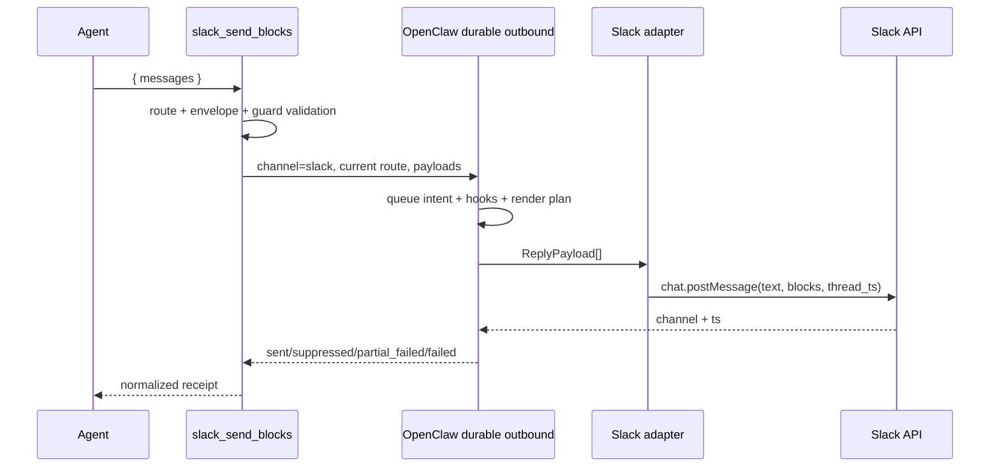

# OpenClaw Slack Block Kit Architecture

[한국어](./ARCHITECTURE.md) · English

> Status: documentation for the v1 implementation
> Baseline runtime: OpenClaw `2026.7.1-2`
> Scope: message-surface raw Block Kit sent to the current Slack conversation

The Korean document, [`ARCHITECTURE.md`](./ARCHITECTURE.md), is the canonical normative
architecture specification. This English document is a maintained normative translation. If the
two documents diverge, the Korean document takes precedence.

## 1. Conclusion

Use OpenClaw's shared `presentation` path by default. This plugin is an escape hatch to use only
when Slack-specific message UI that cannot be expressed through `presentation` is genuinely
required.

```text
Expressible as a shared card
  → core message + presentation

Requires a Slack message-surface-specific representation
  → slack_send_blocks + raw channelData.slack.blocks

Requires a modal / App Home / external select / file or video workflow
  → out of scope for this plugin; use a separate Slack application surface
```

The problem this plugin solves is not “reimplementing the Slack API.” Its purpose is to expose raw
Block Kit payloads through a safe and predictable tool contract while reusing OpenClaw's existing
current-channel, account, and thread context and durable outbound path.

## 2. Goals and Non-goals

### Goals

- Provide the optional agent tool `slack_send_blocks`
- Automatically inherit the currently executing Slack conversation and thread
- Send multiple messages sequentially in one call
- Pass mandatory fallback `text` and raw `blocks` for every message
- Reuse OpenClaw's existing Slack authentication, target resolution, hooks, queue, receipts, and
  unknown-send recovery
- Perform minimum structural, resource, and security validation before sending
- Return distinct validated, sent, suppressed, partial_suppressed, incomplete_sent, partial_failed,
  and failed results
- Suppress duplicate plain-text final responses after a successful direct send on paths that have
  automatic final delivery and exact `runId` metadata

### Non-goals

- Automatically convert every OpenClaw response into Block Kit
- Replace the shared `presentation` mechanism
- Own a separate Slack token, Socket Mode connection, or HTTP ingress
- Act as a general-purpose Slack client that can send to arbitrary channels, accounts, or threads
- Replicate the full Slack Block Kit JSON Schema within this project
- Handle button/select actions in v1
- Support modals, App Home, Options Load, workflow steps, file registration/sharing, or video unfurls
- Guarantee atomic delivery for the entire batch

## 3. Supported Scope

| Capability | v1 | Notes |
|---|---:|---|
| Current Slack channel/DM | Supported | Uses `deliveryContext.to` |
| Current Slack thread | Supported | Inherits `deliveryContext.threadId` |
| Sequential multi-message send | Supported | Preserves payload order |
| section, fields, image, accessory | Supported | Subject to the Slack message surface specification |
| rich_text, table, data_visualization, etc. | Passthrough | Workspace and Slack API support are authoritative |
| Unknown new message block | Passthrough | Not blocked by an allowlist, to avoid version drift |
| button/static select interaction | Rejected | Add through a namespaced handler in v2 |
| actions/input block | Rejected | Interaction-only or view-only |
| file/video/call block | Rejected | Requires separate permissions and registration/unfurl lifecycle |
| modal / App Home | Unsupported | Separate `views.*`-based surface |
| external select | Unsupported | Requires a separate Options Load endpoint |
| File/video workflow | Unsupported | Requires separate permissions and API lifecycle |

“Passthrough support” does not guarantee that Slack will accept the payload. The plugin forwards the
payload without transforming it, and the Slack API acts as the final schema validator.

## 4. Core Components and Responsibilities

| Component | Responsibilities | Does not |
|---|---|---|
| Producer | Fetch data, sort, paginate, and create fallback text and complete blocks | Guess channel/account/thread or call the Slack API |
| `slack_send_blocks` | Verify the current route, perform minimum validation, send through the durable outbound path, and normalize the result | Rewrite blocks or decide business policy |
| OpenClaw outbound runtime | Authentication, hooks, queue, Slack adapter invocation, receipts, and recovery | Design Slack-specific UI |
| Slack API | Final validation against the latest Block Kit schema and workspace permissions | Automatically fix producer bugs |

The plugin does not arbitrarily reorder or truncate blocks created by the producer. It explicitly
rejects payloads that exceed limits or are unsafe.

## 5. Public Tool Contract

### `slack_send_blocks`

```typescript
type SlackSendBlocksInput = {
  messages: Array<{
    text: string;
    blocks: Array<Record<string, unknown>>;
  }>;
  validateOnly?: boolean;
};
```

Routing fields are not accepted in the input.

- No `target`
- No `accountId`
- No `threadTs`
- No Slack token

Preventing destination overrides through tool input reduces the risk that the model guesses a
channel ID and sends to the wrong destination. Use the core `message` tool when a message must be
sent explicitly to another destination.

### Input Limits

- 1–10 messages per call
- Fallback `text` of 1–4,000 characters per message
- 1–50 blocks per message
- Maximum 200 KiB of serialized blocks per message
- Maximum 1 MiB of serialized blocks for the entire call
- Maximum nesting depth of 20

The 200 KiB and 1 MiB values do not reproduce official Slack limits. They are defensive limits in
this plugin that protect the runtime from model-generated payloads.

### Successful Result

```json
{
  "ok": true,
  "status": "sent",
  "complete": true,
  "sent": [
    {
      "index": 0,
      "messageId": "1755771000.123456",
      "channelId": "C12345678"
    }
  ],
  "nextAction": {
    "type": "silent_final",
    "token": "NO_REPLY"
  },
  "warnings": []
}
```

### Partial-failure Result

```json
{
  "ok": false,
  "status": "partial_failed",
  "sent": [
    {
      "index": 0,
      "messageId": "1755771000.123456",
      "channelId": "C12345678"
    }
  ],
  "failed": [
    {
      "index": 1,
      "stage": "platform_send",
      "error": {
        "code": "SLACK_API_ERROR",
        "message": "invalid_blocks"
      }
    }
  ]
}
```

Batches are not atomic. If a caller retries an entire batch after receiving `partial_failed`,
messages that were already sent may be duplicated. The caller must reconstruct and retry only the
failed indexes.

## 6. Plugin Registration

This project exposes an optional tool as its primary surface and also registers narrowly scoped
hooks that handle only completion after a successful direct send. It uses `defineToolPlugin` for
the tool declaration and generated manifest metadata.

```text
plugin.register
  ├─ defineToolPlugin.register
  │    └─ static tool: slack_send_blocks (optional)
  │         └─ factory(toolContext)
  │              ├─ returns null unless the surface is Slack
  │              └─ on Slack, returns a tool that captures the current deliveryContext
  └─ registerCompletionHooks
       ├─ after_tool_call: observe exact run/tool completion
       ├─ reply_payload_sending: cancel only an eligible plain-text final
       └─ gateway/lifecycle cleanup: clear bounded markers
```

`openclaw plugins build` generates the following manifest metadata.

- `activation`
- `contracts.tools: ["slack_send_blocks"]`
- `toolMetadata.slack_send_blocks.optional: true`
- `configSchema`

Whenever the tool name or schema changes, rerun both the generator and
`openclaw plugins validate`. The plugin must not load when runtime registration and manifest
ownership disagree.

## 7. Current-route Resolution

Trust only the `OpenClawPluginToolContext.deliveryContext` received by the tool factory. Here,
“current route” means the exact Slack channel or DM that invoked the tool, and the thread in which
the invocation began.

```text
channel  = deliveryContext.channel  // must be "slack"
to       = deliveryContext.to       // required
account  = deliveryContext.accountId ?? agentAccountId
thread   = deliveryContext.threadId
```

In the following cases, either do not expose the tool or return a structured error.

- The current surface is not Slack
- `deliveryContext.to` is missing
- The current runtime config cannot be obtained

v1 provides no path for input arguments to override the ambient route.

## 8. Delivery Path

Use the public durable helper `sendDurableMessageBatch(...)` instead of calling
`loadAdapter("slack").sendPayload(...)` directly.



Each payload has the following form.

```typescript
{
  text: message.text,
  channelData: {
    slack: {
      blocks: message.blocks
    }
  }
}
```

This path reuses the following facilities.

- Existing `channels.slack` authentication and SecretRef
- Account and DM/channel target handling
- `message_sending`-family hooks
- Write-ahead delivery queue
- Platform receipts
- Ambiguous/unknown-send recovery
- Per-payload outcomes and partial failures

## 9. Validation Philosophy

### What Is Validated

1. TypeBox envelope
   - Basic types and counts for `messages`, `text`, `blocks`, and `validateOnly`
   - The same TypeBox schema is checked again at the tool execution entry point rather than
     assuming that the host/bridge enforces schema validation. Flat `text`/`blocks`, missing
     `messages`, and additional properties are rejected with a structured `INVALID_ARGUMENT`, and
     the durable sender is not invoked.
2. Runtime resource guards
   - Block count, serialized size, and nesting depth
3. Shared identifier guards
   - Type, length, and per-message uniqueness of `block_id` and `action_id`
4. v1 scope guards
   - Reject `input` blocks
   - Reject `actions`, `file`, `video`, and `call` blocks
   - Reject interactive elements containing `action_id`
5. JSON safety
   - Reject circular references or values that cannot be serialized
6. URL guards
   - `url`, `image_url`, and `thumb_url` must be non-empty strings
   - String values must be valid `https:` URLs

### What Is Not Validated

- A replica allowlist of every Slack block/element type
- Every per-block text length and field combination
- New Slack types rejected merely because they are unknown
- Automatic correction of invalid payloads

Slack Block Kit continues to evolve. Maintaining a project-local strict schema would prevent new
types from being used and create two conflicting sources of truth that can disagree with Slack's
actual validator. The local validator therefore guarantees only safety and the explicit v1 scope,
while the Slack API performs the latest semantic validation.

## 10. Interaction Policy

v1 is display-only. Elements containing `action_id` are rejected.

This is a product policy, not a rendering limitation: it prevents dead UI that appears clickable
but does nothing when a user clicks it. If buttons or selects are needed and the shared
`presentation` mechanism is sufficient, use the core path.

Adding raw interactions in v2 requires all of the following.

- Enforce an `action_id` namespace, for example `sbk:<handler>:<action>`
- Use OpenClaw `registerInteractiveHandler`
- Respond first within Slack's short ACK deadline
- Business-level idempotency for duplicate delivery and retries
- Validate permissions, user, and current message
- Define message-update and ephemeral-error policies
- Start with static selects and keep external selects in a separate scope

## 11. Duplicate Final-response Suppression

The raw Block Kit send is itself the user-visible final result. A successful actual send prevents a
duplicate ordinary response through two layers.

1. Tool result
   - Every result has `terminate: false`.
   - Only a `sent` result with platform receipts confirmed for every payload requires the exact
     `NO_REPLY` through `nextAction`.
2. Delivery safety hook
   - `after_tool_call` observes every tool completion in the same run.
   - A run is eligible for suppression only when every observed call in that run is a
     `slack_send_blocks` call with `ok: true`, `status: sent`, and `complete: true`.
   - If any other tool, validation-only call, failed call, or partially successful call is observed,
     the run becomes sticky-ineligible for its TTL; a later successful Slack call cannot reactivate
     it.
   - Because the harness and native relay may observe a single physical call twice under different
     normalized names, observations are merged idempotently using the exact `toolCallId` as the key.
     A confirmed complete send wins within the same call ID, but failures and other tools with
     distinct call IDs remain sticky invalidators.
   - Without a call ID, duplicates cannot be identified safely, so the existing sticky fail-open
     behavior is preserved.
   - Conflicting event/context call IDs are treated as an unkeyed ineligible observation and fail
     open.
   - If the event and context both provide different `runId` values, or no exact `runId` exists, the
     observation is not recorded.
   - The plugin-owned `Map` has a five-minute TTL and limits of 1,024 runs and 256 exact call IDs per
     run; it does not use a session key as fallback correlation. Exceeding the call-ID limit makes
     the run fail open.
   - For the same exact `runId`, cancel at low priority only non-empty plain text in a Slack
     `reply_payload_sending(kind=final)`. If the event/context channels conflict or are not Slack,
     always allow the payload through.
   - A final can be split into multiple payloads, so the marker is not consumed after the first
     cancellation.
   - Error, fallback/compaction/status, reasoning/commentary, media/presentation/interactive,
     channel-specific, empty-text, and unknown future payloads all fail open.
   - Host-normalized `mediaUrl: null`, undefined media/reply slots, empty `mediaUrls`, and
     `audioAsVoice: false` attached to a text-only final are treated as empty/default envelope
     metadata. Non-empty media and `audioAsVoice: true` continue to fail open.
   - Markers are cleared by TTL/capacity pruning and on Gateway stop and plugin runtime
     reset/delete/reload cleanup.

The evidentiary boundary of these two layers depends on the source delivery mode.

| source delivery mode | ordinary model final path | What can be verified |
|---|---|---|
| `message_tool_only` | Ordinary finals are not automatically delivered to the external source | A live smoke test verifies the actual Block Kit send, route/thread inheritance, rendering, and normal run completion. The absence of a visible duplicate message alone does not prove hook cancellation. |
| automatic delivery + exact run metadata | The final passes through `reply_payload_sending` on its way to the adapter | An intentionally generated plain final can verify the live hook E2E. |
| missing or conflicting run/channel metadata | The hook safely fails open | Relies on the `NO_REPLY` model contract and does not hide diagnostic/recovery finals. |

Separately from the first live smoke test, `pnpm verify:completion` reconstructs the relay shape
observed in production inside a fresh process. It uses the real global hook runner and outbound
pipeline and asserts one hook invocation, one cancellation, and zero Slack adapter calls. It is
therefore regression evidence for the safety hook itself.

`api.runContext` is cleared when the run ends and may disappear before the outer final delivery
hook, so it is not used as the correlation store. This hook is only a last-resort safety net for the
live dispatcher when exact run metadata is available. Paths without run metadata, such as durable
route/follow-up delivery, rely on the tool result's `NO_REPLY` contract. When event/context run or
session information conflicts, or when the marker has expired, the hook also fails open and sends
the final.

This design corrects a problem observed in an OpenClaw `2026.7.1-2` live smoke test. A custom tool's
`terminate: true` was not counted as completion of core message delivery, so the run could end as
`incomplete_turn / abandoned` and send an additional `Agent couldn't generate a response` message.
Instead of relying on `terminate`, the normal silent-final path is allowed to complete; if the model
violates the contract, the hook remains a safety net that blocks only the plain-text duplicate final
in a Slack-only run.

## 12. Error and Durability Model

The tool distinguishes the following states.

| Status | Meaning | Completion marker / model follow-up |
|---|---|---|
| `validated` | Validation completed; no external send | None / normal response |
| `sent` | Platform receipts confirmed for every payload (`complete: true`) | Recorded / `NO_REPLY` |
| `partial_suppressed` | Some payloads sent and others suppressed by hooks/policy | None / explain and recover |
| `incomplete_sent` | Top-level send succeeded, but completion of every payload could not be proven | None / explain and recover |
| `suppressed` | Intentionally not sent because of a hook/policy | None / explain and recover |
| `partial_failed` | A later payload failed after some payloads were sent | None / explain and recover |
| `failed` | Failed without a platform receipt | None / explain and recover |

The tool result itself has `terminate: false` in every state.

For Slack rate limits, preserve `retryAfter`. Slack API error strings are structured, but tokens,
complete payloads, and internal stacks are not included in model-facing results.

The native durable queue handles crashes before and after a platform send and unknown-send
recovery. It does not semantically deduplicate the same business request repeated as a new tool
call. Persistent `requestId`-based business idempotency will be designed with a separate store if a
real producer requirement emerges.

## 13. Security

- Do not accept a separate Slack token as input, configuration, or log data.
- Do not route outside the current `deliveryContext`.
- Always require fallback `text` for accessibility and notifications.
- Do not log complete raw blocks or complete Slack errors.
- Return no more than 50 validation issues.
- Register the tool as optional and use it only in explicitly allowlisted agents.
- For URL-bearing fields, the plugin verifies a non-empty string and enforces `https:`. The producer
  is responsible for allowed-domain and image-source policy, and sensitive signed URLs are not
  echoed back in the tool result.

## 14. Project Structure

```text
openclaw-slack-block-kit/
├── docs/
│   ├── ARCHITECTURE.md       # canonical normative design
│   ├── ARCHITECTURE.en.md    # maintained normative English translation
│   └── images/               # README Before/After screenshots
├── scripts/
│   ├── normalize-package-modes.mjs    # normalize npm tarball file modes
│   └── verify-completion-pipeline.mjs # fresh-process completion probe
├── src/
│   ├── index.ts              # defineToolPlugin entry
│   ├── tool.ts               # current-route durable tool
│   ├── tool-copy.ts          # model-facing tool/schema copy
│   ├── completion.ts         # exact-run final completion safety net
│   ├── schema.ts             # TypeBox envelope
│   ├── validator.ts          # minimum guard validation
│   ├── errors.ts             # safe error normalization
│   └── types.ts              # internal result types
├── test/
│   ├── metadata.test.ts      # plugin metadata/manifest contract
│   ├── completion.test.ts    # run correlation, fail-open, bounded cleanup
│   ├── schema-copy.test.ts   # prevent schema-description drift
│   ├── tool-copy.test.ts     # prevent static/runtime tool-copy drift
│   ├── tool.test.ts          # route, durable outcome, silent-final result
│   └── validator.test.ts     # resource/scope guards
├── LICENSE
├── openclaw.plugin.json
├── package.json
├── README.ko.md
└── README.md
```

## 15. Tests and Acceptance Criteria

### Unit Tests

- Inherit to/account/thread from the current Slack `deliveryContext`
- Reject non-Slack and missing-route contexts
- Preserve message order and pass raw blocks unchanged
- Make no external call during `validateOnly`
- Pass through unknown blocks
- Reject more than 50 blocks, oversize payloads, excessive depth, and duplicate IDs
- Reject v1 interactions and input blocks
- Map sent/suppressed/partial_failed/failed results
- Return `terminate: false` for every tool result
- Create a `NO_REPLY` next action and exact-run completion eligibility only for fully successful
  Slack-only runs
- Sticky-invalidate suppression when the same run contains another, failed, or validation-only tool
  completion
- Merge duplicate harness/native-relay observations with the same `toolCallId` idempotently while
  keeping distinct IDs separate
- Fail open for missing/mismatched run or tool-call metadata, session/channel conflicts, non-Slack,
  host notices, and rich/unknown/error finals
- Suppress multiple final chunks; enforce marker TTL, maximum run/call-ID counts, and lifecycle
  cleanup
- Treat an empty `payloadOutcomes` array as the legacy flat-results shape, and never leave an
  incomplete send silent
- Reject non-string, empty, and non-HTTPS URL-bearing fields

### Static and Runtime Verification

```bash
pnpm build
pnpm typecheck
pnpm test
pnpm verify:completion
pnpm plugin:metadata-check
pnpm plugin:validate
```

The metadata check and validation must detect generated manifest drift and verify that
`defineToolPlugin` metadata matches `contracts.tools`.

### Restart-free Development Verification

Do not restart the production Gateway during iterative development.

1. Reconstruct the event/context field shape observed in production live logs as a synthetic
   fixture.
2. In the fresh process used by `pnpm verify:completion`, populate the completion store through the
   registered `after_tool_call` handler, then verify that a normalized plain-text final passes
   through the real OpenClaw global hook runner and outbound delivery pipeline and is cancelled
   before the platform adapter. Bootstrap has an empty payload, so its send loop executes zero
   times. The main verification uses the public `deps.slack` test double as a tripwire and asserts
   one hook invocation, one cancellation, and zero adapter calls; `skipQueue` also omits durable
   queue writes.
3. In a fresh process, confirm the current `dist/` registration with
   `openclaw plugins inspect slack-block-kit --runtime`.
4. Use `openclaw agent --local` with a unique session key and a `validateOnly` turn to verify the
   actual embedded harness, native relay, tool loop, and normal stop. Do not use `--deliver`.
5. Only when a complete-send verification is required, run a local-delivery smoke test against an
   explicit Slack test channel. This path verifies only tool outbound behavior and Slack rendering;
   it does not verify final suppression because the current agent-command delivery does not pass
   `replyPayloadSendingHook` metadata.
6. After all offline/fresh-process checks and independent review have completed, restart the
   production Gateway exactly once. First determine the source delivery mode, then perform only the
   live gate that mode can prove. Under `message_tool_only`, verify send/route/thread/rendering/run
   completion. Claim live E2E verification of the duplicate-final hook only when automatic final
   delivery and exact run metadata are both present.

Changing `plugins.entries.slack-block-kit.enabled` produces a config hot-reload log, but does not
replace an already imported ESM plugin module with new code. Therefore, do not treat an off/on
toggle as evidence of code reload.

### Live Slack Smoke Test

1. Send a section plus fields to the current channel.
2. Send an image accessory.
3. Send rich_text or a recent passthrough block.
4. Confirm thread preservation inside the current thread.
5. Confirm the order of a two-message batch.
6. Use an invalid block to confirm Slack API error normalization.
7. Confirm that no duplicate plain final reply appears after a direct send, and record the source
   delivery mode with the result.
8. Confirm that an automatically delivered run finishes without `incomplete_turn / abandoned` and
   that no fallback error message appears.

On a successful run where an exact `NO_REPLY` produces zero visible finals, OpenClaw diagnostics may
record `zero-count-visible-dispatch`. This is expected and is not a smoke-test failure when no
fallback/error message was sent to the user and the run completed normally.

When CI has no real account, verify through the adapter boundary and retain the live smoke test as a
release-checklist item.

## 16. Phased Plan

### v1 — raw message escape hatch

- `defineToolPlugin` and generated manifest
- Optional `slack_send_blocks`
- Current-route only
- Message batch
- Minimal guard validator
- `sendDurableMessageBatch`
- Structured partial outcomes
- Complete-send `NO_REPLY` plus bounded Slack-only exact-run plain-text suppression

### v1.1 — producer integration

- Pass the producer's complete `{ text, blocks }[]` through unchanged
- Consider typed results or artifact references so the LLM does not have to rewrite large JSON
- Adjust size limits based on real repeated usage

### v2 — limited interaction

- Namespaced buttons/static selects
- ACK, authorization, idempotency, and message updates
- Per-interaction test fixtures

### Candidates for Separate Projects

- Modal / App Home
- External-select Options Load
- File registration/sharing
- Video/unfurl

These features resemble a Slack application adapter more than a natural extension of a sender
plugin.

## 17. ADR Summary

### ADR-001: presentation-first

Accepted. Use the core `presentation` path whenever the content can be expressed through the shared
representation.

### ADR-002: explicit tool, narrowly scoped final-delivery safety hook

Accepted. Call the optional tool only when needed instead of transforming every final response. The
global `reply_payload_sending` hook narrowly cancels only a complete Slack-only exact-run's
plain-text duplicate final and fails open for metadata conflicts, diagnostics, and rich payloads.

### ADR-003: current-route only

Accepted. Use `deliveryContext` and do not accept target overrides.

### ADR-004: durable outbound helper

Accepted. Use `sendDurableMessageBatch` instead of calling the adapter directly.

### ADR-005: minimal validation

Accepted. Check only safety guards locally and use Slack as the latest semantic validator.

### ADR-006: display-only v1

Accepted. Defer interactions to v2, after handler, ACK, and idempotency design is complete.

### ADR-007: non-atomic batch

Accepted. Make partial success explicit and return successful indexes and receipts.
