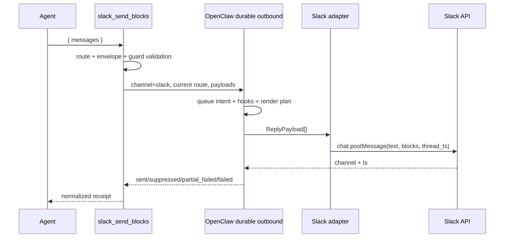

# OpenClaw Slack Block Kit 아키텍처

한국어(기준 원문) · [English](ARCHITECTURE.en.md)

> 상태: v1 구현 기준 문서
> 기준 런타임: OpenClaw `2026.7.1-2`
> 범위: 현재 Slack 대화에 보내는 message-surface raw Block Kit

이 한국어 문서는 프로젝트의 기준 규범적 아키텍처 문서다.
[영문판](ARCHITECTURE.en.md)은 같은 계약을 유지하는 규범적 번역본이며, 두 문서가 어긋나면
이 한국어 원문을 우선한다.

## 1. 결론

OpenClaw의 공통 `presentation`을 기본 경로로 사용한다. 이 플러그인은 `presentation`으로
표현할 수 없는 Slack 전용 메시지 UI가 실제로 필요할 때만 쓰는 escape hatch다.

```text
공통 카드로 표현 가능
  → core message + presentation

Slack message-surface 전용 표현 필요
  → slack_send_blocks + raw channelData.slack.blocks

modal / App Home / external select / file·video workflow 필요
  → 이 플러그인의 범위 밖, 별도 Slack application surface
```

플러그인이 해결하는 문제는 “Slack API를 새로 구현하는 것”이 아니다. OpenClaw이 이미 제공하는
현재 채널·계정·스레드 문맥과 durable outbound 경로를 재사용하면서, raw Block Kit payload를
안전하고 예측 가능한 도구 계약으로 노출하는 것이 목적이다.

## 2. 목표와 비목표

### 목표

- Slack 전용 에이전트 도구 `slack_send_blocks` 제공
- 현재 실행 중인 Slack 대화와 스레드를 자동 상속
- 여러 메시지를 순서대로 한 번에 전송
- 각 메시지에 필수 fallback `text`와 raw `blocks` 전달
- OpenClaw의 기존 Slack 인증, 대상 해석, hook, queue, receipt, unknown-send 복구 재사용
- 전송 전 최소 구조·자원·보안 검증
- validated, sent, suppressed, partial_suppressed, incomplete_sent, partial_failed, failed 결과를
  구분해 반환
- 자동 final delivery와 exact `runId` metadata가 있는 경로에서 성공한 직접 전송 뒤 중복
  plain-text 최종응답 억제

### 비목표

- 모든 OpenClaw 응답을 자동으로 Block Kit으로 변환
- 공통 `presentation` 대체
- 별도 Slack 토큰, Socket Mode 연결, HTTP ingress 보유
- 임의 채널·계정·스레드로 보내는 범용 Slack 클라이언트
- Slack Block Kit 전체 JSON Schema를 프로젝트 안에 복제
- v1에서 button/select action 처리
- modal, App Home, Options Load, workflow step, 파일 등록·공유, video unfurl 지원
- 배치 전체의 원자적 전송 보장

## 3. 지원 범위

| 기능 | v1 | 비고 |
|---|---:|---|
| 현재 Slack 채널/DM | 지원 | `deliveryContext.to` 사용 |
| 현재 Slack 스레드 | 지원 | `deliveryContext.threadId` 상속 |
| 여러 메시지 순차 전송 | 지원 | payload 순서 보존 |
| section, header, context, divider, image, rich_text, table, data_visualization | 이름이 알려진 display passthrough | unknown 경고 없이 공통 guard를 적용하며 section accessory만 image로 제한 |
| 알 수 없는 신규 message block | 경고를 동반한 passthrough | 버전 drift를 막기 위해 차단하지 않음 |
| button/static select interaction | 거부 | v2에서 namespaced handler로 추가 |
| actions/input block | 거부 | interaction 또는 view 전용 |
| file/video/call block | 거부 | 별도 권한·등록·unfurl lifecycle 필요 |
| modal / App Home | 미지원 | `views.*` 기반 별도 surface |
| external select | 미지원 | 별도 Options Load endpoint 필요 |
| 파일·비디오 workflow | 미지원 | 별도 권한과 API lifecycle 필요 |

validator는 `section`, `header`, `context`, `divider`, `image`, `rich_text`, `table`,
`data_visualization`을 하나의 알려진 display block 이름 집합으로 다룬다. 이 집합이 바꾸는 것은
unknown warning 여부뿐이다. 알려진 여덟 type과 warning을 동반한 unknown type 모두 같은 공통
구조·크기·URL·상호작용 guard를 거치며 세부 schema는 passthrough한다. 유일한 type-specific local
rule은 section accessory가 image여야 한다는 것이다. 모든 허용 block은 raw payload 그대로
전달되며, Slack API가 최종 schema validator다.

## 4. 핵심 구성요소와 책임

| 구성요소 | 책임 | 하지 않는 일 |
|---|---|---|
| Producer | 데이터 조회, 정렬, 페이지 분할, fallback text와 완성된 blocks 생성 | 채널·계정·스레드 추측, Slack API 호출 |
| `slack_send_blocks` | 현재 route 확인, 최소 검증, durable 전송, 결과 정규화 | blocks 재작성, 업무 정책 판정 |
| OpenClaw outbound runtime | 인증, hook, queue, Slack adapter 호출, receipt, 복구 | Slack 전용 UI 설계 |
| Slack API | 최신 Block Kit 스키마와 워크스페이스 권한 최종 검증 | producer 버그 자동 수정 |

Producer가 만든 blocks는 플러그인이 임의로 정렬하거나 잘라내지 않는다. 제한을 넘거나 위험한
payload는 명시적으로 거부한다.

## 5. 공개 도구 계약

### `slack_send_blocks`

```typescript
type SlackSendBlocksInput = {
  messages: Array<{
    text: string;
    blocks: Array<Record<string, unknown>>;
  }>;
  validateOnly?: boolean;
};
```

라우팅 필드는 입력에 넣지 않는다.

- `target` 없음
- `accountId` 없음
- `threadTs` 없음
- Slack token 없음

도구 입력을 통해 목적지를 바꿀 수 없게 해야 모델의 채널 ID 추측과 오발송 위험이 줄어든다.
다른 목적지로 명시적으로 보내야 한다면 core `message` 도구를 사용한다.

### 입력 제한

- 호출당 메시지 1~10개
- 메시지당 fallback `text` 1~4,000자
- 메시지당 block 1~50개
- 메시지당 직렬화된 blocks 최대 200 KiB
- 전체 호출의 직렬화된 blocks 최대 1 MiB
- 최대 중첩 깊이 20

200 KiB와 1 MiB는 Slack의 공식 상한을 재현한 값이 아니라, 모델 생성 payload로부터 런타임을
보호하기 위한 이 플러그인의 방어 한도다.

### 성공 결과

```json
{
  "ok": true,
  "status": "sent",
  "complete": true,
  "sent": [
    {
      "index": 0,
      "messageId": "1755771000.123456",
      "channelId": "C12345678"
    }
  ],
  "nextAction": {
    "type": "silent_final",
    "token": "NO_REPLY",
    "instruction": "The Block Kit message is already visible. Return exactly NO_REPLY with no other text."
  },
  "suppressed": [],
  "failed": [],
  "warnings": []
}
```

### 부분 실패 결과

```json
{
  "ok": false,
  "status": "partial_failed",
  "sent": [
    {
      "index": 0,
      "messageId": "1755771000.123456",
      "channelId": "C12345678"
    }
  ],
  "suppressed": [],
  "failed": [
    {
      "index": 1,
      "stage": "platform_send",
      "sentBeforeError": true,
      "error": {
        "code": "SLACK_API_ERROR",
        "message": "invalid_blocks"
      }
    }
  ],
  "error": {
    "code": "SLACK_API_ERROR",
    "message": "invalid_blocks"
  },
  "warnings": []
}
```

배치는 원자적이지 않다. `partial_failed`를 받은 호출자가 전체 배치를 그대로 재시도하면 이미
전송된 메시지가 중복될 수 있으므로 실패한 index만 재구성해야 한다.

## 6. 플러그인 등록

이 프로젝트는 기본 노출되는 Slack 전용 tool을 주 surface로 제공하고, 성공한 직접 전송의
completion만 다루는 좁은 범위의 hooks를 함께 등록한다. 도구 선언과 generated manifest metadata에는
`defineToolPlugin`을 사용한다.

```text
plugin.register
  ├─ defineToolPlugin.register
  │    └─ static tool: slack_send_blocks (기본 노출)
  │         └─ factory(toolContext)
  │              ├─ Slack surface가 아니면 null
  │              └─ Slack이면 현재 deliveryContext를 캡처한 tool 반환
  └─ registerCompletionHooks
       ├─ after_tool_call: exact run/tool completion 관찰
       ├─ reply_payload_sending: eligible plain-text final만 취소
       └─ gateway/lifecycle cleanup: bounded marker 정리
```

`openclaw plugins build`가 다음 manifest metadata를 생성한다.

- `activation`
- `contracts.tools: ["slack_send_blocks"]`
- `configSchema`

권한 수준의 `optional` metadata와 `toolMetadata`는 의도적으로 넣지 않는다. 이 단일 목적
플러그인을 설치하고 활성화하는 것 자체를 일반적인 opt-in으로 보며, factory는 Slack turn이
아니면 `null`을 반환한다. factory의 surface 판정은
`deliveryContext.channel ?? messageChannel` 순서이며, 실제 전송은 아래의 더 엄격한 current-route
검사를 다시 통과해야 한다.

이 결정은 플러그인 등록 계층에서 required/default-visible이라는 뜻일 뿐, OpenClaw host policy를
우회하지 않는다. 전역·agent·provider의 유효한 `tools.profile`과 allow/deny, 그리고 sandbox
tool policy가 계속 우선한다.

- 정상 tool policy: 제한된 profile 또는 allowlist에 추가할 값은 정확한 tool 이름
  `slack_send_blocks`다. 같은 scope에서 `allow`와 `alsoAllow`를 함께 둘 수 없으므로 기존
  `allow`가 있으면 그 배열에 넣고, 아니면 profile 위에 `alsoAllow`로 더한다.
- local onboarding: 새 로컬 설정에서 값이 없을 때 `tools.profile: "coding"`을 설정하며, 기존의
  명시적 profile은 보존한다. `coding`, `messaging`, `minimal`은 이 제3자 native plugin tool을
  기본 포함하지 않는다. `full`과 unset은 profile 자체로 제한하지 않는다.
- sandbox 추가 gate: 실제 sandboxed turn에서는 정상 policy를 통과한 뒤에도 별도 허용이 필요하다.
  특정 native plugin만 열 때는 plugin id `slack-block-kit`, 모든 plugin tool을 열 때만
  `group:plugins`를 `tools.sandbox.tools.alsoAllow` 또는 기존 sandbox `allow`에 쓴다. 명시적인
  sandbox policy가 없어도 기본 sandbox allowlist에는 plugin tool이 없다.

tool 이름이나 schema가 바뀌면 generator와 `openclaw plugins validate`를 반드시 다시 실행한다.
runtime registration이 `contracts.tools` 소유권과 어긋나면 해당 tool registration이 skip되고
diagnostic이 남는다. `plugin:metadata-check`와 `plugin:validate`는 이 drift를 release failure로
취급해야 한다.

## 7. 현재 route 해석

전송 목적지에는 도구 factory가 받은 `OpenClawPluginToolContext.deliveryContext`만 신뢰한다.
여기서 “현재 route”는 도구를 호출한 바로 그 Slack 채널 또는 DM과, 호출이 시작된 thread를
뜻한다. `messageChannel`은 factory 생성 여부의 fallback일 뿐 전송 route의 대체값이 아니다.

실제 전송 route는 다음과 같다.

```text
channel  = deliveryContext.channel  // 반드시 "slack"
to       = deliveryContext.to       // 필수
account  = deliveryContext.accountId ?? agentAccountId
thread   = deliveryContext.threadId
```

`validateOnly: true`는 예외다. 입력과 block 검증을 마치면 route와 runtime config gate보다 먼저
`validated`를 반환하며 durable sender를 호출하지 않는다. 실제 전송에서는 다음 경우 도구를
노출하지 않거나 구조화 오류를 반환한다.

- 현재 surface가 Slack이 아님
- `deliveryContext.to`가 없음
- 현재 runtime config를 얻을 수 없음

입력 인자가 ambient route를 덮어쓰는 경로는 v1에 만들지 않는다.

## 8. 전송 경로

직접 `loadAdapter("slack").sendPayload(...)`를 호출하지 않고 공개 durable helper인
`sendDurableMessageBatch(...)`를 사용한다.



각 payload는 다음 형태다.

```typescript
{
  text: message.text,
  channelData: {
    slack: {
      blocks: message.blocks
    }
  }
}
```

이 경로를 통해 다음을 재사용한다.

- 기존 `channels.slack` 인증과 SecretRef
- account 및 DM/channel target 처리
- `message_sending` 계열 hook
- write-ahead delivery queue
- platform receipt
- ambiguous/unknown send 복구
- per-payload outcome과 partial failure

## 9. 검증 철학

### 검증하는 것

1. TypeBox envelope
   - `messages`, `text`, `blocks`, `validateOnly`의 기본 타입과 개수
   - host/bridge가 schema validation을 강제한다고 가정하지 않고 tool 실행 진입점에서 같은
     TypeBox schema를 다시 검사한다. flat `text`/`blocks`, 누락된 `messages`, 추가 필드는
     `INVALID_ARGUMENT`으로 구조화해 거부하며 durable sender는 호출하지 않는다.
2. 런타임 자원 guard
   - block 수, 직렬화 크기, 중첩 깊이
3. 공통 식별자 guard
   - `block_id`의 타입·길이·메시지 내 중복
   - `action_id`의 타입·길이·중복 진단은 오류를 구체화할 뿐이며, 값의 유효성과 무관하게
     `action_id`가 존재하면 display-only v1에서 항상 거부
4. v1 범위 guard
   - `input` block 거부
   - `actions`, `file`, `video`, `call` block 거부
   - `action_id`가 있는 모든 element/object 거부
5. JSON 안전성
   - 순환 참조나 직렬화 불가능 값 거부
6. URL guard
   - `url`, `image_url`, `thumb_url`은 비어 있지 않은 문자열이어야 함
   - 문자열 값은 유효한 `https:` URL만 허용

### 검증하지 않는 것

- Slack의 모든 block/element type allowlist 복제
- 각 block별 모든 text 길이와 field 조합 재현
- 새 Slack type을 “모른다”는 이유만으로 거부
- 잘못된 payload 자동 수정

Slack Block Kit은 계속 확장된다. 프로젝트가 자체 strict schema를 유지하면 새 type을 사용할 수
없고, Slack의 실제 validator와 불일치하는 이중 진실이 생긴다. 따라서 local validator는 안전과
명확한 v1 범위만 보장하고, 최신 의미 검증은 Slack API에 맡긴다.

## 10. 상호작용 정책

v1은 display-only다. `action_id`가 있는 element는 거부한다.

이 제한은 렌더링 능력 때문이 아니라, 사용자가 눌렀는데 아무 일도 일어나지 않는 dead UI를
방지하기 위한 제품 정책이다. 버튼과 select가 필요하고 공통 `presentation`으로 충분하면 core
경로를 사용한다.

v2에서 raw interaction을 추가할 때는 다음 조건을 모두 만족해야 한다.

- `action_id` namespace 강제, 예: `sbk:<handler>:<action>`
- OpenClaw `registerInteractiveHandler` 사용
- Slack의 짧은 ACK deadline 안에서 먼저 응답
- 중복 delivery와 재시도에 대한 업무 멱등성
- 권한·사용자·현재 message 검증
- message update와 ephemeral error 정책
- static select부터 시작하고 external select는 별도 범위로 유지

## 11. 중복 최종응답 억제

raw Block Kit 전송 자체가 사용자에게 보이는 최종 결과다. 성공한 실제 전송 결과는
다음 두 계층으로 중복 일반 답변을 막는다.

1. 도구 결과
   - 모든 결과는 `terminate: false`다.
   - 전체 payload의 platform receipt가 확인된 `sent` 결과만 `nextAction`으로 정확한 `NO_REPLY`를
     요구한다.
2. delivery safety hook
   - `after_tool_call`에서 같은 run의 모든 tool completion을 관찰한다. 한 observation이 complete
     Slack send로 인정되려면 event와 context의 `toolName`이 모두 정확히 `slack_send_blocks`이고,
     `event.error`가 없으며, result가 `ok: true`, `status: sent`, `complete: true`여야 한다.
   - dedupe된 모든 call observation이 complete Slack send일 때만 run이 suppression eligible이다.
   - 다른 도구, 검증 전용, 실패·부분 성공 observation은 complete Slack send가 아닌 것으로
     판정한다.
   - 한 실제 호출을 harness와 native relay가 여러 observation으로 중복 전달할 수 있으므로 exact
     `toolCallId`를 idempotency key로 합친다. 같은 call id에서는 observation별 판정을 OR해 확인된
     complete send가 우선한다. 이는 서로 다른 observation의 병합일 뿐, 위의 단일 observation
     인정 조건을 완화하지 않는다. 서로 다른 call id는 독립적으로 모두 true여야 하므로 새 call id의
     성공이 기존 false call id를 덮어쓰지 않는다.
   - call id가 없으면 중복 관찰을 식별할 수 없으므로 unkeyed 관찰을 sticky AND로 병합한다.
     unkeyed complete send 하나만 관찰되면 eligible일 수 있지만, complete send가 아닌 unkeyed 관찰이
     하나라도 섞이면 TTL 동안 ineligible이다.
   - event/context의 call id가 충돌하면 unkeyed ineligible 관찰로 처리해 fail-open한다.
   - event와 context가 함께 제공한 `runId`가 다르거나 exact `runId`가 없으면 기록하지 않는다.
   - plugin-owned `Map`은 5분 TTL, 최대 1,024개 run, run당 최대 256개 exact call id 제한을 두며
     session key로 대체 상관관계하지 않는다. call id 상한을 넘으면 해당 run은 fail-open한다.
   - 같은 exact `runId`의 Slack `reply_payload_sending(kind=final)` 중 비어 있지 않은 plain
     text만 낮은 우선순위에서 취소한다. event/context channel이 충돌하거나 Slack이 아니면
     항상 통과한다.
   - final이 여러 payload로 분할될 수 있으므로 첫 취소 뒤 marker를 소비하지 않는다.
   - error, fallback/compaction/status, reasoning/commentary, media/presentation/interactive,
     channel-specific, 빈 text, 알 수 없는 미래 payload는 모두 fail-open한다.
   - `replyToId`, `replyToTag`, `replyToCurrent`는 값과 무관하게 plain-text reply metadata key로
     허용한다. host가 text-only final에 붙이는 `mediaUrl: null`/undefined,
     `mediaUrls: []`/undefined, `audioAsVoice: false`/undefined만 빈/default media metadata로
     간주한다. non-empty media나 `audioAsVoice: true`는 계속 fail-open한다.
   - marker는 TTL/용량 pruning, Gateway stop 또는 plugin runtime lifecycle cleanup callback에서
     제거한다.

두 계층의 증거 범위는 source delivery mode에 따라 다르다.

| source delivery mode | ordinary model final 경로 | 검증 가능한 것 |
|---|---|---|
| `message_tool_only` | ordinary final은 외부 source로 자동 전달되지 않음 | live smoke로 실제 Block Kit 전송, route/thread 상속, 렌더링, 정상 run 종료를 검증. 중복 가시 메시지가 없다는 사실만으로 hook 취소를 증명하지는 않음 |
| automatic delivery + exact run metadata | final이 `reply_payload_sending`을 거쳐 adapter로 향함 | 의도적 plain final을 만들어 live hook E2E 검증 가능 |
| run/channel metadata 누락 또는 충돌 | hook이 안전하게 fail-open | `NO_REPLY` 모델 계약에 의존하며, 진단·복구 final은 숨기지 않음 |

`pnpm verify:completion`은 첫 번째 live smoke와 별개로 production에서 관찰한 relay shape를 fresh
process에 재구성한다. 실제 global hook runner와 outbound pipeline을 사용해 hook 호출 1회, 취소
1회, Slack adapter 호출 0회를 단언하므로 safety hook 자체의 회귀 증거다. 이 probe는
`slack_send_blocks` 실행이나 실제 Slack 전송을 검증하지 않는다. synthetic complete-send result로
`after_tool_call` handler를 채우고, plain final이 adapter tripwire 전에 취소되는 범위만 증명한다.

`api.runContext`는 run 종료 시 지워지고 outer final delivery hook보다 먼저 없어질 수 있으므로 이
상관관계 저장소에 사용하지 않는다. 이 hook은 exact run metadata가 있는 live dispatcher의
마지막 안전망일 뿐이다. durable route/follow-up처럼 run metadata가 없는 경로는 도구 결과의
`NO_REPLY` 계약에 의존한다. event/context의 run 또는 session 정보가 충돌하거나 marker가
만료된 경우에도 fail-open하여 final을 보낸다.

이 구조는 OpenClaw `2026.7.1-2` live smoke에서 확인된 문제를 바로잡는다. 커스텀 도구의
`terminate: true`는 core message delivery 완료로 집계되지 않아 run이
`incomplete_turn / abandoned`로 끝나고 `Agent couldn't generate a response`가 추가 전송될 수
있었다. `terminate`에 의존하지 않고 정상적인 silent final 경로를 완료한 뒤, hook은 모델이 규약을
어겼을 때 Slack-only run에서 생기는 plain-text duplicate final만 막는 안전망으로 둔다.

## 12. 오류와 내구성 모델

도구는 다음 상태를 구분한다.

| 상태 | 의미 | 완료 marker / 모델 후속 |
|---|---|---|
| `validated` | 검증만 완료, 외부 전송 없음 | 없음 / 정상 응답 |
| `sent` | 모든 payload의 플랫폼 receipt 확인 (`complete: true`) | 기록 / `NO_REPLY` |
| `partial_suppressed` | 일부 payload는 전송되고 일부는 hook 취소·빈 payload·식별 가능한 receipt 부재 등으로 suppressed | 없음 / 설명·복구 |
| `incomplete_sent` | top-level send는 성공했지만 모든 payload의 완료를 증명하지 못함 | 없음 / 설명·복구 |
| `suppressed` | durable 경로가 식별 가능한 visible delivery 결과를 만들지 못함(예: hook 취소, 빈 payload, `adapter_returned_no_identity`) | 없음 / 설명·복구 |
| `partial_failed` | 일부 전송 후 후속 payload 실패 | 없음 / 설명·복구 |
| `failed` | 플랫폼 receipt 없이 실패 | 없음 / 설명·복구 |

모든 상태의 tool result는 JSON text `content`와 같은 객체의 `details`를 가지며
`terminate: false`다. 결과별 주요 shape는 다음과 같다.

- `validated`: `messageCount`, `blockCounts`, `warnings`
- 완전한 `sent`: `complete: true`, index별 `sent[]`, `warnings`, `nextAction`
- `partial_suppressed` / `incomplete_sent`: `complete: false`, 관찰된 `sent[]`, `suppressed[]`,
  `failed[]`; `nextAction` 없음
- `suppressed`: top-level `reason`과 index별 `suppressed[]`
- `partial_failed`: 성공한 `sent[]`, index별 `failed[]`, 정규화된 top-level `error`
- `failed`: 항상 정규화된 top-level `error`; durable outcome이 있을 때만 `stage`와 index별
  `failed[]`가 추가될 수 있음

로컬 계약 오류 code는 `INVALID_ARGUMENT`, `INVALID_BLOCK_KIT`, `INVALID_ROUTE`,
`RUNTIME_CONFIG_UNAVAILABLE`이다. durable/Slack 경계 오류는 `SLACK_RATE_LIMITED` 또는
`SLACK_API_ERROR`로 정규화한다. rate-limit metadata에서 유효한 값을 찾은 경우에만 serialized
결과에 `retryAfter`가 나타난다.

Slack API 오류 문자열은 500자로 제한한다. `xox...`, `Bearer ...`,
`token|secret|password=...` 형태의 흔한 token pattern은 best-effort로 redaction하며 임의의 secret을
모두 찾는 검출기는 아니다. 전체 payload, 내부 stack과 durable hook diagnostics는 구조적으로
model-facing 결과에 포함하지 않는다.

native durable queue는 platform send 전후의 crash와 unknown-send 복구를 다룬다. 하지만 같은
업무 요청이 새로운 tool call로 반복되는 것까지 의미론적으로 dedupe하지는 않는다. 영속
`requestId` 기반 업무 멱등성은 실제 producer 요구가 생길 때 별도 저장소와 함께 설계한다.

## 13. 보안

- 별도 Slack token을 입력·설정·로그로 받지 않는다.
- 현재 `deliveryContext` 밖으로 라우팅하지 않는다.
- fallback `text`는 접근성과 알림을 위해 항상 필수다.
- raw blocks와 Slack 오류 전체를 로그에 남기지 않는다.
- `error.issues`는 최대 50개까지만 반환한다. passthrough `warnings`는 이 cap 대상이 아니다.
- tool은 Slack turn에서만 생성하며, 전역·agent·provider의 유효한 tool profile과 policy,
  sandbox tool policy가 플러그인 수준의 기본 노출보다 우선한다.
- 정상 tool policy는 정확한 tool 이름 `slack_send_blocks`로 좁게 허용한다.
- sandbox를 사용하는 agent에는 plugin id `slack-block-kit` 또는 `group:plugins`로 sandbox 수준의
  허용을 요구한다. 명시적인 정책이 없어도 기본 sandbox allowlist는 plugin tool을 제외한다.
- 플러그인은 URL-bearing field가 있을 때 비어 있지 않은 문자열인지 확인하고 `https:`를 강제한다. 허용
  도메인과 이미지 출처 정책은 producer가 책임지며, 민감한 서명 URL을 tool result에 재출력하지
  않는다.

## 14. 프로젝트 구조

```text
openclaw-slack-block-kit/
├── docs/
│   ├── ARCHITECTURE.md       # 기준 규범적 설계
│   ├── ARCHITECTURE.en.md    # 영문 규범적 번역본
│   └── images/               # README Before/After 스크린샷
├── scripts/
│   ├── normalize-package-modes.mjs    # npm tarball 파일 권한 정규화
│   └── verify-completion-pipeline.mjs # fresh-process completion probe
├── src/
│   ├── index.ts              # defineToolPlugin entry
│   ├── tool.ts               # current-route durable tool
│   ├── tool-copy.ts          # model-facing tool 문구와 Slack reference URL
│   ├── completion.ts         # exact-run final completion safety net
│   ├── schema.ts             # TypeBox envelope
│   ├── validator.ts          # 최소 guard validation
│   ├── errors.ts             # 안전한 오류 정규화
│   └── types.ts              # 입력과 validation 타입
├── test/
│   ├── metadata.test.ts      # plugin metadata/manifest 계약
│   ├── completion.test.ts    # run correlation, fail-open, bounded cleanup
│   ├── schema-copy.test.ts   # schema 설명 drift 방지
│   ├── tool-copy.test.ts     # model-facing 필수 selection/completion 문구 계약 고정
│   ├── tool.test.ts          # route, durable outcome, silent-final result
│   └── validator.test.ts     # resource/scope guard
├── LICENSE
├── openclaw.plugin.json        # generated manifest contract
├── package.json                # build/test/validation/publish scripts
├── pnpm-lock.yaml
├── README.ko.md
├── README.md
├── tsconfig.build.json
└── tsconfig.json
```

## 15. 테스트와 승인 기준

### 단위 테스트

현재 기준은 6개 test file, 60개 test 모두 통과다. 아래 항목은 테스트가 보장하는 현재 계약이며,
동작을 추가하거나 바꾸면 count와 acceptance 목록도 함께 갱신한다.

- Slack 외부에서 tool factory는 `null`, Slack turn에서는 canonical tool 반환
- runtime과 generated manifest 모두 permission-level `optional`이 없고
  `contracts.tools: ["slack_send_blocks"]`로 일치
- 현재 Slack `deliveryContext`의 to/account/thread 상속
- non-Slack 및 missing-route actual send 거부
- raw blocks를 durable helper에 그대로 전달
- `validateOnly`에서 외부 호출 없음
- section/image accessory 허용과 unknown block warning passthrough
- 50개 초과, 크기, 깊이, duplicate id 거부
- v1 interactive와 input block 거부
- sent/incomplete_sent/suppressed/partial_suppressed/partial_failed/failed 결과 매핑
- 모든 tool result가 `terminate: false`
- 완전 성공한 Slack-only run에만 `NO_REPLY` next action과 exact-run completion eligibility 생성
- event/context 모두 정확한 `slack_send_blocks`, event error 없음, complete sent result일 때만
  observation 인정
- 동일 `toolCallId`의 여러 observation은 idempotent OR로 병합하고, distinct call id는 각각 true,
  unkeyed observation은 sticky AND를 요구
- missing/mismatched run metadata, tool call id 충돌, session/channel 충돌, non-Slack, host notice,
  rich/unknown/error final은 fail-open
- 여러 final chunk 억제, marker TTL·run/call-id 최대 개수, lifecycle cleanup
- 빈 `payloadOutcomes`의 legacy flat-results fallback과 incomplete-send 무음 금지
- URL-bearing field의 비문자·빈 값·non-HTTPS 거부

### 정적·런타임 검증

```bash
pnpm build
pnpm typecheck
pnpm test
pnpm verify:completion
pnpm plugin:metadata-check
pnpm plugin:validate
npm pack --dry-run
```

metadata check와 validate는 generated manifest drift 및 `defineToolPlugin`
metadata/`contracts.tools` 일치를 검사해야 한다.

### 재시작 없는 개발 검증

변경 반복 중에는 production Gateway를 재시작하지 않는다.

1. production live 로그에서 확인한 event/context field shape를 synthetic fixture로 재구성한다.
2. `pnpm verify:completion`의 fresh process에서 `after_tool_call` 등록 handler로 completion store를
   채운 뒤, normalized plain-text final은 실제 OpenClaw global hook runner와 outbound delivery
   pipeline을 거쳐 platform adapter 전에 취소되는지 확인한다. bootstrap은 빈 payload로 send loop가
   0회다. 본 검증은 public `deps.slack` test double을 tripwire로 두고 hook 호출·취소 각 1회와 adapter
   호출 0회를 단언하며, `skipQueue`로 durable queue write도 생략한다.
3. `openclaw plugins inspect slack-block-kit --runtime`의 fresh process에서 현재 `dist/` 등록을 확인한다.
4. 고유 session key의 `openclaw agent --local` + `validateOnly` turn으로 실제 embedded harness,
   native relay, tool loop와 정상 stop을 확인한다. `--deliver`는 사용하지 않는다.
5. complete-send 검증이 필요할 때만 명시적인 Slack test channel을 대상으로 local delivery smoke를
   수행한다. 이 경로는 tool outbound와 Slack rendering만 검증하며 final suppression은 검증하지
   않는다. 현재 agent-command delivery가 `replyPayloadSendingHook` metadata를 넘기지 않기 때문이다.
6. 모든 offline/fresh-process 검증과 독립 리뷰가 끝난 뒤 production Gateway를 한 번만 재시작하고
   source delivery mode를 먼저 확인한 다음 그 모드에서 증명 가능한 live gate만 수행한다.
   `message_tool_only`에서는 send/route/thread/rendering/run completion을 확인하고, automatic final
   delivery와 exact run metadata가 모두 있을 때만 duplicate-final hook의 live E2E를 주장한다.

`plugins.entries.slack-block-kit.enabled` 변경은 config hot reload 로그를 남기지만 이미 import된 ESM
plugin module을 새 코드로 교체하지 않는다. 따라서 off/on toggle을 코드 reload 증거로 간주하지
않는다.

### 실제 Slack smoke test

1. 현재 채널에 section + fields 전송
2. image accessory 전송
3. rich_text 또는 최신 passthrough block 전송
4. 현재 thread 안에서 thread 보존 확인
5. 두 메시지 batch 순서 확인
6. 로컬 guard는 통과하지만 Slack이 세부 schema로 거부하는 payload로 `SLACK_API_ERROR`
   정규화 확인
7. 직접 전송 뒤 중복 plain final reply가 없는지 확인하고, source delivery mode를 함께 기록
8. 자동 전달 run이 `incomplete_turn / abandoned` 없이 끝나고 fallback 오류 메시지가 없는지 확인

정확한 `NO_REPLY`로 visible final이 0개가 된 성공 run에서는 OpenClaw 진단 로그에
`zero-count-visible-dispatch`가 남을 수 있다. 사용자에게 fallback/error 메시지가 전송되지 않고
run이 정상 완료되었다면 이는 예상 가능한 진단이며 smoke 실패로 보지 않는다.

실제 계정이 없는 CI에서는 adapter 경계까지 검증하고, live smoke는 release checklist로 유지한다.

## 16. 구현 상태와 후속 범위

### v1 — 구현됨

- `defineToolPlugin`과 generated manifest
- 기본 노출되며 Slack factory로 제한되는 `slack_send_blocks`
- current-route only
- messages batch
- minimal guard validator
- `sendDurableMessageBatch`
- structured partial outcome
- complete-send `NO_REPLY` + bounded Slack-only exact-run plain-text suppression

### v1.1 — producer 연동

- producer가 완성한 `{ text, blocks }[]`를 그대로 전달
- 큰 JSON을 LLM이 재작성하지 않도록 typed result 또는 artifact reference 가능성 검토
- 실제 반복 사용에서 필요한 size limit 조정

### v2 — 제한된 interaction

- namespaced button/static select
- ACK, authorization, idempotency, message update
- interaction별 테스트 fixture

### 별도 프로젝트 후보

- modal / App Home
- external select Options Load
- 파일 등록·공유
- video/unfurl

이 기능들은 sender plugin의 자연스러운 확장이 아니라 Slack application adapter에 가깝다.

## 17. ADR 요약

### ADR-001: presentation-first

채택. 공통 표현이 가능하면 core `presentation`을 사용한다.

### ADR-002: explicit tool, narrowly scoped final-delivery safety hook

채택. 모든 최종 응답을 변환하지 않고 필요할 때만 명시적 tool을 호출한다. global
`reply_payload_sending` hook은 complete Slack-only exact-run의 plain-text duplicate final만 좁게
취소하고, metadata 충돌·진단·rich payload는 fail-open한다.

### ADR-003: current-route only

채택. `deliveryContext`를 사용하고 target override를 받지 않는다.

### ADR-004: durable outbound helper

채택. 직접 adapter 호출 대신 `sendDurableMessageBatch`를 사용한다.

### ADR-005: minimal validation

채택. 안전 guard만 로컬에서 검사하고 Slack을 최신 의미 validator로 사용한다.

### ADR-006: display-only v1

채택. interaction은 handler·ACK·멱등성 설계가 끝난 v2로 분리한다.

### ADR-007: non-atomic batch

채택. 부분 성공을 명시하고 성공 index/receipt를 반환한다.
