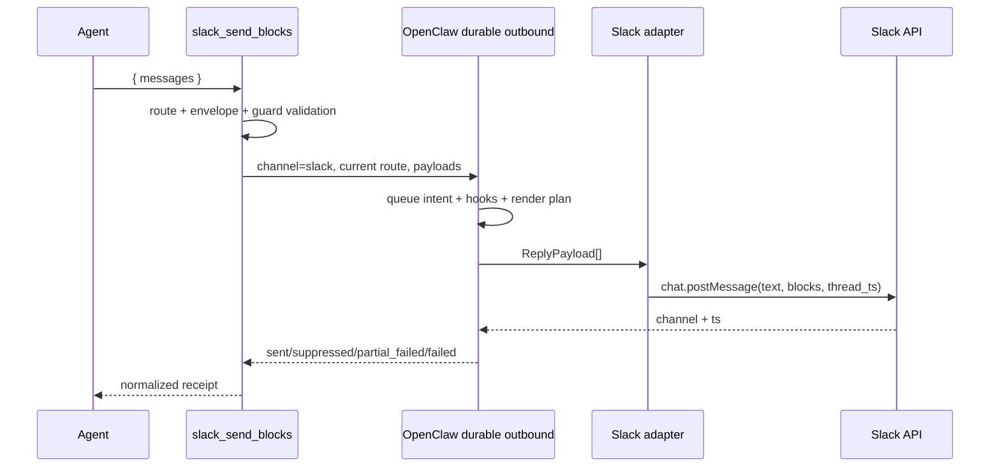

# OpenClaw Slack Block Kit 아키텍처

한국어(기준 원문) · [English](ARCHITECTURE.en.md)

> 상태: v1 구현 기준 문서
> 기준 런타임: OpenClaw `2026.7.1-2`
> 범위: 현재 Slack 대화에 보내는 message-surface raw Block Kit

이 한국어 문서는 프로젝트의 기준 규범적 아키텍처 문서다.
[영문판](ARCHITECTURE.en.md)은 같은 계약을 유지하는 규범적 번역본이며, 두 문서가 어긋나면
이 한국어 원문을 우선한다.

## 1. 결론

OpenClaw의 공통 `presentation`을 기본 경로로 사용한다. 이 플러그인은 `presentation`으로
표현할 수 없는 Slack 전용 메시지 UI가 실제로 필요할 때만 쓰는 escape hatch다.

```text
공통 카드로 표현 가능
  → core message + presentation

Slack message-surface 전용 표현 필요
  → slack_send_blocks + raw channelData.slack.blocks

modal / App Home / external select / file·video workflow 필요
  → 이 플러그인의 범위 밖, 별도 Slack application surface
```

플러그인이 해결하는 문제는 “Slack API를 새로 구현하는 것”이 아니다. OpenClaw이 이미 제공하는
현재 채널·계정·스레드 문맥과 durable outbound 경로를 재사용하면서, raw Block Kit payload를
안전하고 예측 가능한 도구 계약으로 노출하는 것이 목적이다.

## 2. 목표와 비목표

### 목표

- Slack 전용 에이전트 도구 `slack_send_blocks` 제공
- 현재 실행 중인 Slack 대화와 스레드를 자동 상속
- 여러 메시지를 순서대로 한 번에 전송
- 각 메시지에 필수 fallback `text`와 raw `blocks` 전달
- OpenClaw의 기존 Slack 인증, 대상 해석, hook, queue, receipt, unknown-send 복구 재사용
- 전송 전 최소 구조·자원·보안 검증
- validated, sent, suppressed, partial_suppressed, incomplete_sent, partial_failed, failed 결과를
  구분해 반환
- 모든 메시지 전송에 성공하면 에이전트에게 정확한 `NO_REPLY`로 마무리하도록 지시
- 전역 전송 훅을 등록하지 않고 OpenClaw의 진행 표시와 최종 답변 처리를 유지

### 비목표

- 모든 OpenClaw 응답을 자동으로 Block Kit으로 변환
- 공통 `presentation` 대체
- 별도 Slack 토큰, Socket Mode 연결, HTTP ingress 보유
- 임의 채널·계정·스레드로 보내는 범용 Slack 클라이언트
- Slack Block Kit 전체 JSON Schema를 프로젝트 안에 복제
- v1에서 button/select action 처리
- modal, App Home, Options Load, workflow step, 파일 등록·공유, video unfurl 지원
- 배치 전체의 원자적 전송 보장

## 3. 지원 범위

| 기능 | v1 | 비고 |
|---|---:|---|
| 현재 Slack 채널/DM | 지원 | `deliveryContext.to` 사용 |
| 현재 Slack 스레드 | 지원 | `deliveryContext.threadId` 상속 |
| 여러 메시지 순차 전송 | 지원 | payload 순서 보존 |
| section, header, context, divider, image, rich_text, table, data_visualization | 이름이 알려진 display passthrough | unknown 경고 없이 공통 guard를 적용하며 section accessory만 image로 제한 |
| 알 수 없는 신규 message block | 경고를 동반한 passthrough | 버전 drift를 막기 위해 차단하지 않음 |
| button/static select interaction | 거부 | v2에서 namespaced handler로 추가 |
| actions/input block | 거부 | interaction 또는 view 전용 |
| file/video/call block | 거부 | 별도 권한·등록·unfurl lifecycle 필요 |
| modal / App Home | 미지원 | `views.*` 기반 별도 surface |
| external select | 미지원 | 별도 Options Load endpoint 필요 |
| 파일·비디오 workflow | 미지원 | 별도 권한과 API lifecycle 필요 |

validator는 `section`, `header`, `context`, `divider`, `image`, `rich_text`, `table`,
`data_visualization`을 하나의 알려진 display block 이름 집합으로 다룬다. 이 집합이 바꾸는 것은
unknown warning 여부뿐이다. 알려진 여덟 type과 warning을 동반한 unknown type 모두 같은 공통
구조·크기·URL·상호작용 guard를 거치며 세부 schema는 passthrough한다. 유일한 type-specific local
rule은 section accessory가 image여야 한다는 것이다. 모든 허용 block은 raw payload 그대로
전달되며, Slack API가 최종 schema validator다.

## 4. 핵심 구성요소와 책임

| 구성요소 | 책임 | 하지 않는 일 |
|---|---|---|
| Producer | 데이터 조회, 정렬, 페이지 분할, fallback text와 완성된 blocks 생성 | 채널·계정·스레드 추측, Slack API 호출 |
| `slack_send_blocks` | 현재 route 확인, 최소 검증, durable 전송, 결과 정규화 | blocks 재작성, 업무 정책 판정 |
| OpenClaw outbound runtime | 인증, hook, queue, Slack adapter 호출, receipt, 복구 | Slack 전용 UI 설계 |
| Slack API | 최신 Block Kit 스키마와 워크스페이스 권한 최종 검증 | producer 버그 자동 수정 |

Producer가 만든 blocks는 플러그인이 임의로 정렬하거나 잘라내지 않는다. 제한을 넘거나 위험한
payload는 명시적으로 거부한다.

## 5. 공개 도구 계약

### `slack_send_blocks`

```typescript
type SlackSendBlocksInput = {
  messages: Array<{
    text: string;
    blocks: Array<Record<string, unknown>>;
  }>;
  validateOnly?: boolean;
};
```

라우팅 필드는 입력에 넣지 않는다.

- `target` 없음
- `accountId` 없음
- `threadTs` 없음
- Slack token 없음

도구 입력을 통해 목적지를 바꿀 수 없게 해야 모델의 채널 ID 추측과 오발송 위험이 줄어든다.
다른 목적지로 명시적으로 보내야 한다면 core `message` 도구를 사용한다.

### 입력 제한

- 호출당 메시지 1~10개
- 메시지당 fallback `text` 1~4,000자
- 메시지당 block 1~50개
- 메시지당 직렬화된 blocks 최대 200 KiB
- 전체 호출의 직렬화된 blocks 최대 1 MiB
- 최대 중첩 깊이 20

200 KiB와 1 MiB는 Slack의 공식 상한을 재현한 값이 아니라, 모델 생성 payload로부터 런타임을
보호하기 위한 이 플러그인의 방어 한도다.

### 성공 결과

```json
{
  "ok": true,
  "status": "sent",
  "complete": true,
  "sent": [
    {
      "index": 0,
      "messageId": "1755771000.123456",
      "channelId": "C12345678"
    }
  ],
  "nextAction": {
    "type": "silent_final",
    "token": "NO_REPLY",
    "instruction": "The Block Kit message is already visible. Return exactly NO_REPLY with no other text."
  },
  "suppressed": [],
  "failed": [],
  "warnings": []
}
```

### 부분 실패 결과

```json
{
  "ok": false,
  "status": "partial_failed",
  "sent": [
    {
      "index": 0,
      "messageId": "1755771000.123456",
      "channelId": "C12345678"
    }
  ],
  "suppressed": [],
  "failed": [
    {
      "index": 1,
      "stage": "platform_send",
      "sentBeforeError": true,
      "error": {
        "code": "SLACK_API_ERROR",
        "message": "invalid_blocks"
      }
    }
  ],
  "error": {
    "code": "SLACK_API_ERROR",
    "message": "invalid_blocks"
  },
  "warnings": []
}
```

배치는 원자적이지 않다. `partial_failed`를 받은 호출자가 전체 배치를 그대로 재시도하면 이미
전송된 메시지가 중복될 수 있으므로 실패한 index만 재구성해야 한다.

## 6. 플러그인 등록

이 프로젝트는 기본 노출되는 Slack 전용 tool 하나를 등록한다. 도구 선언과 generated manifest
metadata에는 `defineToolPlugin`을 사용한다. 전송 훅, 도구 완료 관찰 훅, 완료 상태 정리용
lifecycle handler는 등록하지 않는다.

```text
plugin.register (defineToolPlugin)
  └─ static tool: slack_send_blocks (기본 노출)
       └─ factory(toolContext)
            ├─ Slack surface가 아니면 null
            └─ Slack이면 현재 deliveryContext를 캡처한 tool 반환
```

`openclaw plugins build`가 다음 manifest metadata를 생성한다.

- `activation`
- `contracts.tools: ["slack_send_blocks"]`
- `configSchema`

권한 수준의 `optional` metadata와 `toolMetadata`는 의도적으로 넣지 않는다. 이 단일 목적
플러그인을 설치하고 활성화하는 것 자체를 일반적인 opt-in으로 보며, factory는 Slack turn이
아니면 `null`을 반환한다. factory의 surface 판정은
`deliveryContext.channel ?? messageChannel` 순서이며, 실제 전송은 아래의 더 엄격한 current-route
검사를 다시 통과해야 한다.

이 결정은 플러그인 등록 계층에서 required/default-visible이라는 뜻일 뿐, OpenClaw host policy를
우회하지 않는다. 전역·agent·provider의 유효한 `tools.profile`과 allow/deny, 그리고 sandbox
tool policy가 계속 우선한다.

- 정상 tool policy: 제한된 profile 또는 allowlist에 추가할 값은 정확한 tool 이름
  `slack_send_blocks`다. 같은 scope에서 `allow`와 `alsoAllow`를 함께 둘 수 없으므로 기존
  `allow`가 있으면 그 배열에 넣고, 아니면 profile 위에 `alsoAllow`로 더한다.
- local onboarding: 새 로컬 설정에서 값이 없을 때 `tools.profile: "coding"`을 설정하며, 기존의
  명시적 profile은 보존한다. `coding`, `messaging`, `minimal`은 이 제3자 native plugin tool을
  기본 포함하지 않는다. `full`과 unset은 profile 자체로 제한하지 않는다.
- sandbox 추가 gate: 실제 sandboxed turn에서는 정상 policy를 통과한 뒤에도 별도 허용이 필요하다.
  특정 native plugin만 열 때는 plugin id `slack-block-kit`, 모든 plugin tool을 열 때만
  `group:plugins`를 `tools.sandbox.tools.alsoAllow` 또는 기존 sandbox `allow`에 쓴다. 명시적인
  sandbox policy가 없어도 기본 sandbox allowlist에는 plugin tool이 없다.

tool 이름이나 schema가 바뀌면 generator와 `openclaw plugins validate`를 반드시 다시 실행한다.
runtime registration이 `contracts.tools` 소유권과 어긋나면 해당 tool registration이 skip되고
diagnostic이 남는다. `plugin:metadata-check`와 `plugin:validate`는 이 drift를 release failure로
취급해야 한다.

## 7. 현재 route 해석

전송 목적지에는 도구 factory가 받은 `OpenClawPluginToolContext.deliveryContext`만 신뢰한다.
여기서 “현재 route”는 도구를 호출한 바로 그 Slack 채널 또는 DM과, 호출이 시작된 thread를
뜻한다. `messageChannel`은 factory 생성 여부의 fallback일 뿐 전송 route의 대체값이 아니다.

실제 전송 route는 다음과 같다.

```text
channel  = deliveryContext.channel  // 반드시 "slack"
to       = deliveryContext.to       // 필수
account  = deliveryContext.accountId ?? agentAccountId
thread   = deliveryContext.threadId
```

`validateOnly: true`는 예외다. 입력과 block 검증을 마치면 route와 runtime config gate보다 먼저
`validated`를 반환하며 durable sender를 호출하지 않는다. 실제 전송에서는 다음 경우 도구를
노출하지 않거나 구조화 오류를 반환한다.

- 현재 surface가 Slack이 아님
- `deliveryContext.to`가 없음
- 현재 runtime config를 얻을 수 없음

입력 인자가 ambient route를 덮어쓰는 경로는 v1에 만들지 않는다.

## 8. 전송 경로

직접 `loadAdapter("slack").sendPayload(...)`를 호출하지 않고 공개 durable helper인
`sendDurableMessageBatch(...)`를 사용한다.



각 payload는 다음 형태다.

```typescript
{
  text: message.text,
  channelData: {
    slack: {
      blocks: message.blocks
    }
  }
}
```

이 경로를 통해 다음을 재사용한다.

- 기존 `channels.slack` 인증과 SecretRef
- account 및 DM/channel target 처리
- `message_sending` 계열 hook
- write-ahead delivery queue
- platform receipt
- ambiguous/unknown send 복구
- per-payload outcome과 partial failure

## 9. 검증 철학

### 검증하는 것

1. TypeBox envelope
   - `messages`, `text`, `blocks`, `validateOnly`의 기본 타입과 개수
   - host/bridge가 schema validation을 강제한다고 가정하지 않고 tool 실행 진입점에서 같은
     TypeBox schema를 다시 검사한다. flat `text`/`blocks`, 누락된 `messages`, 추가 필드는
     `INVALID_ARGUMENT`으로 구조화해 거부하며 durable sender는 호출하지 않는다.
2. 런타임 자원 guard
   - block 수, 직렬화 크기, 중첩 깊이
3. 공통 식별자 guard
   - `block_id`의 타입·길이·메시지 내 중복
   - `action_id`의 타입·길이·중복 진단은 오류를 구체화할 뿐이며, 값의 유효성과 무관하게
     `action_id`가 존재하면 display-only v1에서 항상 거부
4. v1 범위 guard
   - `input` block 거부
   - `actions`, `file`, `video`, `call` block 거부
   - `action_id`가 있는 모든 element/object 거부
5. JSON 안전성
   - 순환 참조나 직렬화 불가능 값 거부
6. URL guard
   - `url`, `image_url`, `thumb_url`은 비어 있지 않은 문자열이어야 함
   - 문자열 값은 유효한 `https:` URL만 허용

### 검증하지 않는 것

- Slack의 모든 block/element type allowlist 복제
- 각 block별 모든 text 길이와 field 조합 재현
- 새 Slack type을 “모른다”는 이유만으로 거부
- 잘못된 payload 자동 수정

Slack Block Kit은 계속 확장된다. 프로젝트가 자체 strict schema를 유지하면 새 type을 사용할 수
없고, Slack의 실제 validator와 불일치하는 이중 진실이 생긴다. 따라서 local validator는 안전과
명확한 v1 범위만 보장하고, 최신 의미 검증은 Slack API에 맡긴다.

## 10. 상호작용 정책

v1은 display-only다. `action_id`가 있는 element는 거부한다.

이 제한은 렌더링 능력 때문이 아니라, 사용자가 눌렀는데 아무 일도 일어나지 않는 dead UI를
방지하기 위한 제품 정책이다. 버튼과 select가 필요하고 공통 `presentation`으로 충분하면 core
경로를 사용한다.

v2에서 raw interaction을 추가할 때는 다음 조건을 모두 만족해야 한다.

- `action_id` namespace 강제, 예: `sbk:<handler>:<action>`
- OpenClaw `registerInteractiveHandler` 사용
- Slack의 짧은 ACK deadline 안에서 먼저 응답
- 중복 delivery와 재시도에 대한 업무 멱등성
- 권한·사용자·현재 message 검증
- message update와 ephemeral error 정책
- static select부터 시작하고 external select는 별도 범위로 유지

## 11. 최종응답 계약

raw Block Kit 전송 자체가 사용자에게 보이는 최종 결과다. 중복 일반 답변 방지는 에이전트의
`NO_REPLY` 지시 준수에 맡긴다.

- 도구 설명은 이 도구를 해당 turn의 마지막 도구로 단독 호출하도록 안내한다.
- `ok: true`, `status: sent`, `complete: true`일 때만 `nextAction`으로 정확한 `NO_REPLY`를
  요구한다. 모델은 다른 문구를 붙이지 않고 정상적인 silent final로 마무리한다.
- 검증 전용, 실패, 부분 성공, suppressed, incomplete 결과에는 silent-final 지시를 넣지 않는다.
  에이전트는 필요한 설명이나 복구를 수행할 수 있다.
- 모든 결과는 `terminate: false`다. 도구가 run을 강제로 끝내지 않고 모델의 정상 종료를 허용한다.

플러그인은 전송 후 완료 마커를 저장하거나 최종 답변을 취소하지 않는다. 따라서 에이전트가
`NO_REPLY` 지시를 어기면 일반 텍스트 답변이 추가될 수 있으며, 코드가 중복 방지를 보장하지 않는다.
진행 표시, commentary, 오류와 최종 답변의 전달 여부는 OpenClaw가 관리한다.

OpenClaw `2026.9.4`의 Slack 처리는 `reply_payload_sending` 또는 `message_sending` 전역 훅이
존재하면 `progress` 스트리밍 경로를 비활성화한다. 훅 내부를 final 전용으로 제한해도 등록 자체가
영향을 주므로 이 플러그인은 해당 훅을 등록하지 않는다. 다른 플러그인의 전송 훅과 호스트 설정은
여전히 진행 표시에 영향을 줄 수 있다.

기존 OpenClaw `2026.7.1-2` live smoke에서는 커스텀 도구의 `terminate: true`가 정상적인 응답
완료로 집계되지 않아 `incomplete_turn / abandoned`와 fallback 오류가 발생했다. 따라서 훅을
제거한 뒤에도 `terminate: false`와 성공 시 `NO_REPLY` 계약을 유지한다.

## 12. 오류와 내구성 모델

도구는 다음 상태를 구분한다.

| 상태 | 의미 | 모델 후속 |
|---|---|---|
| `validated` | 검증만 완료, 외부 전송 없음 | 정상 응답 |
| `sent` | 모든 payload의 플랫폼 receipt 확인 (`complete: true`) | `NO_REPLY` |
| `partial_suppressed` | 일부 payload는 전송되고 일부는 hook 취소·빈 payload·식별 가능한 receipt 부재 등으로 suppressed | 설명·복구 |
| `incomplete_sent` | top-level send는 성공했지만 모든 payload의 완료를 증명하지 못함 | 설명·복구 |
| `suppressed` | durable 경로가 식별 가능한 visible delivery 결과를 만들지 못함(예: hook 취소, 빈 payload, `adapter_returned_no_identity`) | 설명·복구 |
| `partial_failed` | 일부 전송 후 후속 payload 실패 | 설명·복구 |
| `failed` | 플랫폼 receipt 없이 실패 | 설명·복구 |

모든 상태의 tool result는 JSON text `content`와 같은 객체의 `details`를 가지며
`terminate: false`다. 결과별 주요 shape는 다음과 같다.

- `validated`: `messageCount`, `blockCounts`, `warnings`
- 완전한 `sent`: `complete: true`, index별 `sent[]`, `warnings`, `nextAction`
- `partial_suppressed` / `incomplete_sent`: `complete: false`, 관찰된 `sent[]`, `suppressed[]`,
  `failed[]`; `nextAction` 없음
- `suppressed`: top-level `reason`과 index별 `suppressed[]`
- `partial_failed`: 성공한 `sent[]`, index별 `failed[]`, 정규화된 top-level `error`
- `failed`: 항상 정규화된 top-level `error`; durable outcome이 있을 때만 `stage`와 index별
  `failed[]`가 추가될 수 있음

로컬 계약 오류 code는 `INVALID_ARGUMENT`, `INVALID_BLOCK_KIT`, `INVALID_ROUTE`,
`RUNTIME_CONFIG_UNAVAILABLE`이다. durable/Slack 경계 오류는 `SLACK_RATE_LIMITED` 또는
`SLACK_API_ERROR`로 정규화한다. rate-limit metadata에서 유효한 값을 찾은 경우에만 serialized
결과에 `retryAfter`가 나타난다.

Slack API 오류 문자열은 500자로 제한한다. `xox...`, `Bearer ...`,
`token|secret|password=...` 형태의 흔한 token pattern은 best-effort로 redaction하며 임의의 secret을
모두 찾는 검출기는 아니다. 전체 payload, 내부 stack과 durable hook diagnostics는 구조적으로
model-facing 결과에 포함하지 않는다.

native durable queue는 platform send 전후의 crash와 unknown-send 복구를 다룬다. 하지만 같은
업무 요청이 새로운 tool call로 반복되는 것까지 의미론적으로 dedupe하지는 않는다. 영속
`requestId` 기반 업무 멱등성은 실제 producer 요구가 생길 때 별도 저장소와 함께 설계한다.

## 13. 보안

- 별도 Slack token을 입력·설정·로그로 받지 않는다.
- 현재 `deliveryContext` 밖으로 라우팅하지 않는다.
- fallback `text`는 접근성과 알림을 위해 항상 필수다.
- raw blocks와 Slack 오류 전체를 로그에 남기지 않는다.
- `error.issues`는 최대 50개까지만 반환한다. passthrough `warnings`는 이 cap 대상이 아니다.
- tool은 Slack turn에서만 생성하며, 전역·agent·provider의 유효한 tool profile과 policy,
  sandbox tool policy가 플러그인 수준의 기본 노출보다 우선한다.
- 정상 tool policy는 정확한 tool 이름 `slack_send_blocks`로 좁게 허용한다.
- sandbox를 사용하는 agent에는 plugin id `slack-block-kit` 또는 `group:plugins`로 sandbox 수준의
  허용을 요구한다. 명시적인 정책이 없어도 기본 sandbox allowlist는 plugin tool을 제외한다.
- 플러그인은 URL-bearing field가 있을 때 비어 있지 않은 문자열인지 확인하고 `https:`를 강제한다. 허용
  도메인과 이미지 출처 정책은 producer가 책임지며, 민감한 서명 URL을 tool result에 재출력하지
  않는다.

## 14. 프로젝트 구조

```text
openclaw-slack-block-kit/
├── docs/
│   ├── ARCHITECTURE.md       # 기준 규범적 설계
│   ├── ARCHITECTURE.en.md    # 영문 규범적 번역본
│   └── images/               # README Before/After 스크린샷
├── scripts/
│   └── normalize-package-modes.mjs    # npm tarball 파일 권한 정규화
├── src/
│   ├── index.ts              # defineToolPlugin entry
│   ├── tool.ts               # current-route durable tool
│   ├── tool-copy.ts          # model-facing tool 문구와 Slack reference URL
│   ├── schema.ts             # TypeBox envelope
│   ├── validator.ts          # 최소 guard validation
│   ├── errors.ts             # 안전한 오류 정규화
│   └── types.ts              # 입력과 validation 타입
├── test/
│   ├── metadata.test.ts      # plugin metadata/manifest 계약
│   ├── schema-copy.test.ts   # schema 설명 drift 방지
│   ├── tool-copy.test.ts     # model-facing 필수 selection/completion 문구 계약 고정
│   ├── tool.test.ts          # route, durable outcome, silent-final result
│   └── validator.test.ts     # resource/scope guard
├── LICENSE
├── openclaw.plugin.json        # generated manifest contract
├── package.json                # build/test/validation/publish scripts
├── pnpm-lock.yaml
├── README.ko.md
├── README.md
├── tsconfig.build.json
└── tsconfig.json
```

## 15. 테스트와 승인 기준

### 단위 테스트

아래 항목은 5개 test file이 검증하는 계약이다. 동작을 바꾸면 acceptance 목록도 함께 갱신한다.

- Slack 외부에서 tool factory는 `null`, Slack turn에서는 canonical tool 반환
- runtime과 generated manifest 모두 permission-level `optional`이 없고
  `contracts.tools: ["slack_send_blocks"]`로 일치
- 현재 Slack `deliveryContext`의 to/account/thread 상속
- non-Slack 및 missing-route actual send 거부
- raw blocks를 durable helper에 그대로 전달
- `validateOnly`에서 외부 호출 없음
- section/image accessory 허용과 unknown block warning passthrough
- 50개 초과, 크기, 깊이, duplicate id 거부
- v1 interactive와 input block 거부
- sent/incomplete_sent/suppressed/partial_suppressed/partial_failed/failed 결과 매핑
- 모든 tool result가 `terminate: false`
- 모든 메시지 전송에 성공했을 때만 `NO_REPLY` next action 반환
- 플러그인 등록 시 도구 하나만 등록하고 typed/legacy hooks 및 runtime lifecycle handler는 등록하지 않음
- 빈 `payloadOutcomes`의 legacy flat-results fallback과 incomplete-send 무음 금지
- URL-bearing field의 비문자·빈 값·non-HTTPS 거부

### 정적·런타임 검증

```bash
pnpm build
pnpm typecheck
pnpm test
pnpm plugin:metadata-check
pnpm plugin:validate
npm pack --dry-run
```

metadata check와 validate는 generated manifest drift 및 `defineToolPlugin`
metadata/`contracts.tools` 일치를 검사해야 한다.

### 재시작 없는 개발 검증

변경 반복 중에는 production Gateway를 재시작하지 않는다.

1. build, typecheck, 전체 테스트와 manifest 검증을 실행한다. 등록 테스트는 도구 노출뿐 아니라
   typed/legacy hooks와 runtime lifecycle handler를 등록하지 않는지도 확인한다.
2. 설치된 호스트와의 호환성이 필요하면 격리된 fresh process에서 빌드된 entry를 로드하고, 가짜
   등록 API로 도구 하나와 훅 0개를 확인한다. 운영 설정과 세션 DB를 변경하지 않는다.
3. 주입된 sender를 사용하는 도구 테스트로 route/thread 상속, 원본 blocks 보존, 전송 결과와
   성공 시에만 반환되는 `NO_REPLY`를 확인한다. 실제 Slack 전송은 수행하지 않는다.
4. 운영 반영이 승인된 뒤 검증된 빌드를 설치하고 Gateway를 한 번 재시작한다. 플러그인 활성 상태에서
   Block Kit을 쓰지 않는 요청과 쓰는 요청 각각의 진행 표시 및 최종 결과를 실제 Slack에서 확인한다.

훅 미등록 검증은 이 플러그인이 알려진 progress 차단 조건을 추가하지 않는다는 증거다. 실제 화면의
진행 표시나 에이전트의 `NO_REPLY` 준수까지 증명하지는 않는다.

`plugins.entries.slack-block-kit.enabled` 변경은 config hot reload 로그를 남기지만 이미 import된 ESM
plugin module을 새 코드로 교체하지 않는다. 따라서 off/on toggle을 코드 reload 증거로 간주하지
않는다.

### 실제 Slack smoke test

1. 현재 채널에 section + fields 전송
2. image accessory 전송
3. rich_text 또는 최신 passthrough block 전송
4. 현재 thread 안에서 thread 보존 확인
5. 두 메시지 batch 순서 확인
6. 로컬 guard는 통과하지만 Slack이 세부 schema로 거부하는 payload로 `SLACK_API_ERROR`
   정규화 확인
7. 완전한 전송 성공 뒤 에이전트가 `NO_REPLY`로 마무리하는지 확인하고, source delivery mode를 함께 기록
8. 자동 전달 run이 `incomplete_turn / abandoned` 없이 끝나고 fallback 오류 메시지가 없는지 확인
9. 플러그인이 활성화된 상태에서 도구 미사용/사용 요청의 progress와 최종 결과를 각각 확인

정확한 `NO_REPLY`로 visible final이 0개가 된 성공 run에서는 OpenClaw 진단 로그에
`zero-count-visible-dispatch`가 남을 수 있다. 사용자에게 fallback/error 메시지가 전송되지 않고
run이 정상 완료되었다면 이는 예상 가능한 진단이며 smoke 실패로 보지 않는다.

실제 계정이 없는 CI에서는 adapter 경계까지 검증하고, live smoke는 release checklist로 유지한다.

## 16. 구현 상태와 후속 범위

### v1 — 구현됨

- `defineToolPlugin`과 generated manifest
- 기본 노출되며 Slack factory로 제한되는 `slack_send_blocks`
- current-route only
- messages batch
- minimal guard validator
- `sendDurableMessageBatch`
- structured partial outcome
- complete-send `NO_REPLY` 지시, 전송 훅과 완료 상태 저장소 없음

### v1.1 — producer 연동

- producer가 완성한 `{ text, blocks }[]`를 그대로 전달
- 큰 JSON을 LLM이 재작성하지 않도록 typed result 또는 artifact reference 가능성 검토
- 실제 반복 사용에서 필요한 size limit 조정

### v2 — 제한된 interaction

- namespaced button/static select
- ACK, authorization, idempotency, message update
- interaction별 테스트 fixture

### 별도 프로젝트 후보

- modal / App Home
- external select Options Load
- 파일 등록·공유
- video/unfurl

이 기능들은 sender plugin의 자연스러운 확장이 아니라 Slack application adapter에 가깝다.

## 17. ADR 요약

### ADR-001: presentation-first

채택. 공통 표현이 가능하면 core `presentation`을 사용한다.

### ADR-002: explicit tool, agent-owned silent final

채택. 필요할 때 명시적 tool을 호출하고, 모든 메시지 전송에 성공하면 에이전트가 `NO_REPLY`로
마무리한다. 전역 전송 훅과 완료 마커를 두지 않는다. 에이전트가 지시를 어길 때의 중복 답변
가능성을 받아들이고, OpenClaw의 진행 표시와 일반 답변 전송을 플러그인이 가로채지 않는다.

### ADR-003: current-route only

채택. `deliveryContext`를 사용하고 target override를 받지 않는다.

### ADR-004: durable outbound helper

채택. 직접 adapter 호출 대신 `sendDurableMessageBatch`를 사용한다.

### ADR-005: minimal validation

채택. 안전 guard만 로컬에서 검사하고 Slack을 최신 의미 validator로 사용한다.

### ADR-006: display-only v1

채택. interaction은 handler·ACK·멱등성 설계가 끝난 v2로 분리한다.

### ADR-007: non-atomic batch

채택. 부분 성공을 명시하고 성공 index/receipt를 반환한다.
